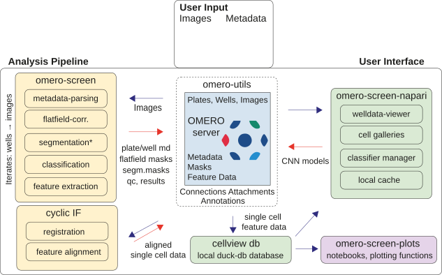

.. omero-screen documentation master file

OmeroScreen Documentation
=========================

**OmeroScreen** is an end-to-end high-content image analysis pipeline for immunofluorescence
microscopy data. Built on top of the `OMERO <https://www.openmicroscopy.org/omero/>`_ server,
it integrates automated cell segmentation, feature extraction, cell-cycle classification,
local data storage, and publication-ready visualisation into a single, reproducible workflow.

   OmeroScreen architecture. The five packages of the monorepo cover the full journey from
   raw microscopy plates on an OMERO server through segmentation and feature extraction
   (omero-screen), local single-cell database management (cellview), interactive data
   exploration (omero-screen-napari), and publication-ready figure generation
   (omero-screen-plots). Shared server utilities are provided by omero-utils.

Key Components
--------------

*   **omero-screen** — Core analysis pipeline: Cellpose-based nucleus/cell segmentation,
    regionprops feature extraction, and cell-cycle phase assignment.
*   **cellview** — DuckDB-backed single-cell database with a clean Python API and CLI.
*   **omero-screen-plots** — Suite of statistical plots designed for publication figures.
*   **omero-screen-napari** — Napari plugins for interactive image browsing, gallery
    inspection, and ML training-data generation.
*   **omero-utils** — Low-level helpers for OMERO server interaction (connections,
    attachments, map annotations, image I/O).

Installation
------------

Quick start using ``uv``:

.. code-block:: bash

    # Install uv (if not already installed)
    curl -LsSf https://astral.sh/uv/install.sh | sh

    # Clone the repository
    git clone https://github.com/Helfrid/omero-screen.git
    cd omero-screen

    # Create and activate virtual environment
    uv sync --dev
    source .venv/bin/activate

Documentation Contents
----------------------

.. toctree::
   :maxdepth: 2
   :caption: Omero Screen

   pipeline
   cyclic_if
   configuration
   developer_guide

.. toctree::
   :maxdepth: 2
   :caption: Packages

   Omero Screen Plots <omero-screen-plots/index>
   Cellview <cellview/index>
   Omero Screen Napari <omero-screen-napari/index>
