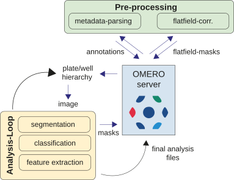

Image Analysis Pipeline
=======================

This section describes the core analysis pipeline of ``omero-screen``: how it fetches
data from an OMERO server, segments cells, extracts features, and stores results.

Pipeline Overview
-----------------

Each plate is processed by ``plate_loop()``, which orchestrates the following stages in order:

   **Analysis loop.** Starting from a plate ID on the OMERO server, the pipeline parses
   experimental metadata, generates per-channel flatfield correction masks, then iterates
   over every non-empty well. Within each well every image is segmented with Cellpose,
   features are extracted with ``skimage.measure.regionprops``, and results are written
   back to OMERO as CSV attachments. After all wells are processed, cell-cycle phase
   assignment and optional image classification are performed, and final summary files
   are attached to the plate object.

The stages are:

1. **Metadata parsing** — reads the experimental layout from an Excel file attached to
   the plate object (well positions, cell lines, conditions, channel names). After
   parsing, the metadata is converted to OMERO map-annotations and the Excel file is
   removed.

2. **Flatfield correction** — generates per-channel illumination correction masks by
   aggregating a random sample of 100 images across the plate. Masks are cached in a
   dedicated OMERO dataset so subsequent runs skip this step.

3. **Well / image loop** — for each non-empty well and each image within it:

   * Raw pixel data are downloaded from OMERO and divided by the flatfield mask.
   * Cellpose segments nuclei (DAPI/Hoechst channel) and cells (cytoplasm channel).
   * Border objects are filtered; cytoplasm masks are derived as cell minus nucleus.
   * ``skimage.measure.regionprops_table`` extracts area, intensity statistics, and
     centroid for nucleus, cell, and cytoplasm regions.
   * Per-well results are written back to OMERO as intermediate CSV attachments,
     enabling crash recovery.

4. **Cell-cycle analysis** — if an EdU channel is present, DNA content (integrated
   DAPI intensity) and EdU signal are normalised per cell line and used to assign each
   nucleus to G1, S, G2/M, sub-G1, or polyploid.

5. **Save results** — final plate-level CSVs and QC figures are attached to the OMERO
   plate object; intermediate per-well files are deleted.

.. _stitched-mode:

Stitched-Mode Segmentation
--------------------------

By default the pipeline segments each field-of-view image independently and then
merges the results. For plates where every well is tiled (multi-position
acquisitions on Operetta / Opera / similar systems), the ``--stitch`` flag
switches to a **whole-well canvas** workflow:

1. All fields of a well are downloaded and flatfield-corrected.
2. The fields are stitched into a single ``(T, Y, X, C)`` canvas using stage
   positions read from OMERO.
3. **Cellpose runs once** on the stitched canvas — internal tiling handles the
   large input. This removes the per-field seam problem where a cell straddling
   two fields would be cut in half by the border filter on each side.
4. The resulting whole-well mask is **split back into per-field tiles**
   (each label belongs to exactly one field by centroid) and uploaded to the
   OMERO segmentation dataset with the suffix ``_stitched_segmentation``.
5. Feature extraction proceeds on the stitched canvas, so each cell appears
   exactly once in the output CSV.

When to use ``--stitch``:

* **Multi-position acquisitions** with tiled fields per well — the default path.
* **Live-cell time-lapse**, where a single global segmentation produces
  consistent labels across the canvas.
* **Large cells** that frequently straddle field boundaries.

When *not* to use ``--stitch``:

* **Single-position acquisitions** (one image per well). The legacy per-field
  path is faster and there is no benefit to stitching.
* **Plates without reliable stage-position metadata**. The stitcher needs
  ``PosX`` / ``PosY`` on each well-sample; if those are absent or noisy, the
  canvas will not align.

The downstream napari widgets detect stitched-mode plates automatically (by
looking for ``_stitched_segmentation`` images in the dataset) and load the
masks correctly without further configuration. See
:doc:`omero-screen-napari/welldata_widget` for the cache-backend split.

.. _channel-seg-profiles:

Per-Channel Segmentation Profiles
---------------------------------

Cellpose's default thresholds work well on the high-contrast, even-intensity
images you get from fixed-cell IF (DAPI, Hoechst). They struggle on live-cell
fluorescent markers like **H2B-RFP** (variable per-cell brightness) or
**Tubulin-GFP** (heterogeneous expression). The pipeline exposes a
``CHANNEL_SEG_PROFILES`` map in the default config that applies bespoke
preprocessing and Cellpose parameters when those channel names appear:

.. code-block:: python

   CHANNEL_SEG_PROFILES = {
       "h2b_rfp": {"gamma": 0.5, "cellprob_threshold": -2.0},
       "tub_gfp": {
           "gamma": 0.5,
           "cellprob_threshold": -2.0,
           "flow_threshold": 0.6,
       },
   }

The lookup is **case-insensitive** on the channel name. Three knobs are
supported:

* ``gamma`` — dynamic-range compression applied after percentile rescaling and
  before Cellpose. ``< 1`` lifts dim values and compresses the bright end,
  which improves detection of dim nuclei in frames that also contain bright
  ones.
* ``cellprob_threshold`` — passed directly to ``cellpose.eval()``. Lower it
  (e.g. ``-2``) to accept less-confident detections.
* ``flow_threshold`` — passed directly to ``cellpose.eval()``. Useful for
  cell-channel segmentation when Tubulin signal is faint at the cell edge.

Override by setting ``OMERO_SCREEN_CONFIG`` to a JSON file with a
``CHANNEL_SEG_PROFILES`` block. Channels with no entry use the default
Cellpose parameters — fixed-cell pipelines are unaffected.

.. _temporal-tracking:

Temporal Tracking
-----------------

For live-cell time-lapse plates the pipeline can link segmented nuclei across
the time axis so each cell carries a stable ``track_id`` for its whole
lifetime. Tracking uses `Trackastra <https://github.com/weigertlab/trackastra>`_
(Weigert lab, ECCV 2024) — a track-by-detection model with strong pretrained
weights and no hyperparameters to tune — and is enabled with the ``--track``
flag.

How it works:

1. Tracking runs on the **stitched whole-well nucleus mask**, so it requires
   ``--stitch`` and links cells coherently across field-of-view boundaries.
2. Trackastra relabels the nucleus mask **in place** so each nucleus's label
   *is* its ``track_id``. Because cell and cytoplasm measurements are tied to
   the nucleus by spatial overlap, they inherit the track id automatically.
3. Four columns flow into the measurements CSV and on into CellView:
   ``track_id`` and ``parent_track_id`` (the current, curatable values) plus
   immutable ``track_id_raw`` / ``parent_track_id_raw`` originals. A division
   gives the two daughter tracks new ids whose ``parent_track_id`` points at
   the mother.
4. Tracking is a **no-op on single-timepoint (fixed-cell) plates** — a run with
   ``--track`` set on a ``T == 1`` plate produces byte-identical output to a
   run without it.

Tracks are then viewed and curated downstream: explore them in napari with the
:doc:`omero-screen-napari/tracks_widget`, and hand-correct them in Mastodon via
the OME-Zarr cache. See the :doc:`tracking` overview for the end-to-end story.

Linking modes are selected with ``--track-mode``:

* ``greedy`` *(default)* — fast greedy linking with divisions.
* ``greedy_nodiv`` — slightly faster, no divisions (rarely useful for
  cell-cycle work).
* ``ilp`` — integer-linear-programming linking; most accurate, slowest, and
  requires the optional ``motile`` solver stack.

Command Line Interface
----------------------

run_omero_screen
~~~~~~~~~~~~~~~~

The main entry point for running the analysis pipeline against one or more plates.

.. code-block:: bash

    omero-screen ID [ID ...] [options]

**Positional arguments**

.. list-table::
   :widths: 20 80
   :header-rows: 1

   * - Argument
     - Description
   * - ``ID``
     - One or more OMERO plate IDs to process (space-separated).

**Options**

.. list-table::
   :widths: 25 15 60
   :header-rows: 1

   * - Flag
     - Default
     - Description
   * - ``--env ENV``
     - development
     - Environment name. Loads ``.env.{ENV}`` for server credentials and logging config.
   * - ``--segmentation``
     - off
     - Run segmentation only — skip feature extraction and cell-cycle analysis. Useful
       for inspecting mask quality before a full run.
   * - ``--cp4``
     - off
     - Use **Cellpose 4** (``cpsam``) for all segmentation models instead of the
       default Cellpose 3 models. ``cpsam`` is the Segment Anything Model (SAM)-based
       model included in Cellpose 4 and generally produces higher-quality masks,
       especially for irregularly shaped cells.
   * - ``--model MODEL``
     - —
     - Override **all** segmentation models with a single model name (e.g.
       ``cp4:cpsam``, ``cp3:cyto3``). Takes precedence over ``--cp4``. Useful for
       testing a new model across an entire plate without editing the config file.
   * - ``--inference MODEL [MODEL ...]``
     - —
     - One or more inference model filenames for post-segmentation image classification.
       Multiple models are applied sequentially to each cell crop.
   * - ``--gallery N``
     - 10
     - Width *N* of the N×N example gallery generated for each predicted class when
       ``--inference`` is active.
   * - ``--batch N``
     - 16
     - Batch size for inference classification.
   * - ``--benchmark``
     - off
     - Record per-image timing data and write a JSON benchmark report at the end of
       the run.
   * - ``--stitch``
     - off
     - Run segmentation on a stitched whole-well canvas instead of per-field.
       See :ref:`stitched-mode` for when to use this. Required for live-cell
       time-lapse plates and for the OME-Zarr napari cache backend.
   * - ``--track [MODEL]``
     - off
     - Track nuclei across time with Trackastra (see :ref:`temporal-tracking`).
       Optional ``MODEL`` is a pretrained name or checkpoint path; the flag
       alone defaults to ``general_2d``. Requires ``--stitch`` and a timelapse
       (``T > 1``); a no-op on single-timepoint plates.
   * - ``--track-mode MODE``
     - greedy
     - Trackastra linking mode: ``greedy``, ``greedy_nodiv``, or ``ilp``.

**Examples**

.. code-block:: bash

    # Analyse a single plate in the default (development) environment
    omero-screen 12345

    # Analyse multiple plates in the production environment
    omero-screen 12345 67890 --env production

    # Segment only — no feature extraction (fast QC pass)
    omero-screen 12345 --segmentation

    # Use Cellpose 4 SAM-based models for better mask quality
    omero-screen 12345 --cp4

    # Override all models with a specific Cellpose 3 model
    omero-screen 12345 --model cp3:cyto3

    # Run with an image classifier and generate 15×15 example galleries
    omero-screen 12345 --inference my_classifier.pth --gallery 15

    # Record benchmark timing data
    omero-screen 12345 --benchmark

    # Stitched-mode segmentation (live-cell time-lapse, multi-tile per well)
    omero-screen 12345 --stitch --cp4

    # Live-cell tracking: stitched segmentation + Trackastra nucleus tracking
    omero-screen 12345 --stitch --track general_2d

sbatch_omero_screen
~~~~~~~~~~~~~~~~~~~

*(Sussex HPC specific)* Submits ``omero-screen`` jobs to a SLURM cluster.

.. code-block:: bash

    python bin/sbatch_omero_screen.py ID [ID ...] [options]

**Job submission options**

.. list-table::
   :widths: 30 15 55
   :header-rows: 1

   * - Flag
     - Default
     - Description
   * - ``--class CLASS``
     - gpu
     - SLURM job class.
   * - ``-u / --username USER``
     - current user
     - Cluster username.
   * - ``-t / --threads N``
     - 1
     - CPU threads. Increase when running without a GPU.
   * - ``--hours N``
     - 24
     - Maximum wall-clock hours for the job.
   * - ``-m / --memory N``
     - 32
     - Memory in GB.
   * - ``--gpu``
     - on
     - Request a GPU node.
   * - ``--exec``
     - on
     - Execute the generated script statements.
   * - ``--submit``
     - on
     - Submit via ``sbatch``.
   * - ``--multi-submit``
     - on
     - Submit one job per plate ID.

**OmeroScreen overrides** (passed through to each job)

.. list-table::
   :widths: 30 70
   :header-rows: 1

   * - Flag
     - Description
   * - ``--inference MODEL``
     - Inference model(s).
   * - ``--env ENV``
     - Environment name.
   * - ``--segmentation``
     - Only perform image segmentation.
   * - ``--cp4``
     - Use Cellpose 4 (cpsam) models.
   * - ``--model MODEL``
     - Override all segmentation models with a single model name.
   * - ``--stitch``
     - Run stitched whole-well segmentation.
   * - ``--track [MODEL]``
     - Track nuclei across time with Trackastra (requires ``--stitch``).
   * - ``--track-mode MODE``
     - Trackastra linking mode (``greedy`` / ``greedy_nodiv`` / ``ilp``).
