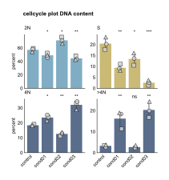

Cell Cycle Plot API
===================

.. currentmodule:: omero_screen_plots.cellcycleplot_api

The cell cycle plot provides comprehensive visualization of cell cycle phase distributions across experimental conditions in a multi-panel grid layout with statistical analysis and flexible phase terminology.

Main Functions
--------------

.. autofunction:: cellcycle_plot

Examples
--------

Default Cell Cycle Analysis
~~~~~~~~~~~~~~~~~~~~~~~~~~~

Create a standard 2x3 grid showing all cell cycle phases with statistical analysis::

    from omero_screen_plots import cellcycle_plot
    import pandas as pd

    df = pd.read_csv("data.csv")
    fig, axes = cellcycle_plot(
        df=df,
        conditions=['control', 'cond01', 'cond02', 'cond03'],
        condition_col="condition",
        selector_col="cell_line",
        selector_val="MCF10A",
        title="Cell Cycle Analysis",
        save=True,
        file_format="svg"
    )

.. image:: ../_static/cellcycle_plot_default.svg

DNA Content Visualization
~~~~~~~~~~~~~~~~~~~~~~~~~

Focus on DNA content measurements with 2x2 grid layout::

    fig, axes = cellcycle_plot(
        df=df,
        conditions=['control', 'cond01', 'cond02', 'cond03'],
        condition_col="condition",
        selector_col="cell_line",
        selector_val="MCF10A",
        cc_phases=False,  # Use DNA content terminology (<2N, 2N, S, 4N, >4N)
        title="DNA Content Analysis"
    )

Custom Phase Selection
~~~~~~~~~~~~~~~~~~~~~~

Analyze specific cell cycle phases with custom terminology::

    fig, axes = cellcycle_plot(
        df=df,
        conditions=['control', 'cond01', 'cond02', 'cond03'],
        condition_col="condition",
        selector_col="cell_line",
        selector_val="MCF10A",
        cc_phases=True,
        show_subG1=False,  # Exclude SubG1
        title="Major Cell Cycle Phases"
    )

.. image:: ../_static/cellcycle_plot_no_SubG1.svg

Clean Layout with Custom Colors
~~~~~~~~~~~~~~~~~~~~~~~~~~~~~~~

Create publication-ready figures with custom styling::

    from omero_screen_plots.colors import COLOR

    custom_colors = [COLOR.LIGHT_BLUE.value, COLOR.BLUE.value,
                     COLOR.GREY.value, COLOR.DARK_GREY.value]

    fig, axes = cellcycle_plot(
        df=df,
        conditions=['control', 'cond01', 'cond02', 'cond03'],
        condition_col="condition",
        selector_col="cell_line",
        selector_val="MCF10A",
        show_subG1=True,
        colors=custom_colors,
        show_repeat_points=False,
        title="Custom Styled Cell Cycle"
    )

.. image:: ../_static/cellcycle_plot_custom_colors.svg
