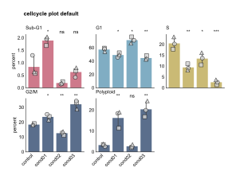
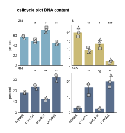
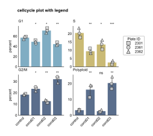
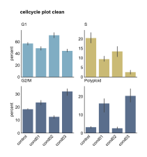
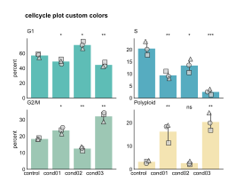
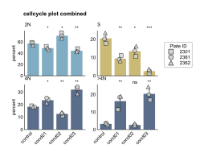

CellCyclePlot API
=================

.. currentmodule:: omero_screen_plots.cellcycleplot_api

The cellcycleplot module provides comprehensive visualization of cell cycle phase distributions across experimental conditions. It creates a 2x2 or 2x3 subplot grid showing each cell cycle phase separately with optional statistical analysis, plate identification, and flexible terminology.

Main Functions
--------------

.. autofunction:: cellcycle_plot

Legacy Functions
----------------

.. currentmodule:: omero_screen_plots.cellcycleplot

.. autofunction:: cellcycle_stacked

.. autofunction:: cellcycle_grouped

Examples
--------

Default Cell Cycle Plot
~~~~~~~~~~~~~~~~~~~~~~~

Create a standard cell cycle plot with all phases and statistical analysis::

    from omero_screen_plots import cellcycle_plot
    import pandas as pd

    df = pd.read_csv("data.csv")
    fig, axes = cellcycle_plot(
        df=df,
        conditions=['control', 'cond01', 'cond02', 'cond03'],
        selector_val="MCF10A",
        title="cellcycle plot default",
        show_subG1=True,  # Show all phases including Sub-G1
        save=True,
        path="output/",
        file_format="svg",
        dpi=300
    )

DNA Content Terminology
~~~~~~~~~~~~~~~~~~~~~~~

Use DNA content terminology (<2N, 2N, S, 4N, >4N) instead of cell cycle phase names::

    fig, axes = cellcycle_plot(
        df=df,
        conditions=['control', 'cond01', 'cond02', 'cond03'],
        selector_val="MCF10A",
        title="cellcycle plot DNA content",
        cc_phases=False,  # Use DNA content terminology
        save=True,
        path="output/",
        file_format="svg"
    )

Compact Layout Without Sub-G1
~~~~~~~~~~~~~~~~~~~~~~~~~~~~~~

Create a compact 2x2 layout by excluding the Sub-G1 phase::

    fig, axes = cellcycle_plot(
        df=df,
        conditions=['control', 'cond01', 'cond02', 'cond03'],
        selector_val="MCF10A",
        title="cellcycle plot no SubG1",
        show_subG1=False,  # Hide Sub-G1 phase (default is already False)
        save=True,
        path="output/",
        file_format="svg"
    )

Plate Identification with Legend
~~~~~~~~~~~~~~~~~~~~~~~~~~~~~~~~~

Show different shapes for each plate_id with an explanatory legend::

    fig, axes = cellcycle_plot(
        df=df,
        conditions=['control', 'cond01', 'cond02', 'cond03'],
        selector_val="MCF10A",
        title="cellcycle plot with legend",
        show_repeat_points=True,
        show_plate_legend=True,  # Show plate shapes legend
        save=True,
        path="output/",
        file_format="svg"
    )

Clean Visualization
~~~~~~~~~~~~~~~~~~~

Create a clean plot without statistical elements for presentations::

    fig, axes = cellcycle_plot(
        df=df,
        conditions=['control', 'cond01', 'cond02', 'cond03'],
        selector_val="MCF10A",
        title="cellcycle plot clean",
        show_repeat_points=False,  # Hide repeat points
        show_significance=False,   # Hide significance marks
        save=True,
        path="output/",
        file_format="svg"
    )

Custom Styling
~~~~~~~~~~~~~~

Apply custom colors and formatting options::

    fig, axes = cellcycle_plot(
        df=df,
        conditions=['control', 'cond01', 'cond02', 'cond03'],
        selector_val="MCF10A",
        title="cellcycle plot custom colors",
        colors=["#FF6B6B", "#4ECDC4", "#45B7D1", "#96CEB4", "#FFEAA7"],
        fig_size=(8, 6),
        rotation=0,  # No rotation for x-labels
        save=True,
        path="output/",
        file_format="svg"
    )

Combined Features
~~~~~~~~~~~~~~~~~

Combine multiple advanced features for specific analysis needs::

    fig, axes = cellcycle_plot(
        df=df,
        conditions=['control', 'cond01', 'cond02', 'cond03'],
        selector_val="MCF10A",
        title="cellcycle plot combined",
        cc_phases=False,         # DNA terminology
        show_subG1=False,       # No Sub-G1
        show_plate_legend=True, # Show legend
        fig_size=(6, 5),
        save=True,
        path="output/",
        file_format="svg"
    )

Key Features
------------

Automatic Phase Detection
~~~~~~~~~~~~~~~~~~~~~~~~~

The function automatically detects if your data contains separate G2 and M phases:

- **Standard phases** (5 phases): Sub-G1, G1, S, G2/M, Polyploid → 2x3 layout
- **With M phase** (6 phases): Sub-G1, G1, S, G2, M, Polyploid → 2x3 layout
- **Without Sub-G1** (4 phases): G1, S, G2/M, Polyploid → 2x2 layout

Variable Layouts
~~~~~~~~~~~~~~~~

The subplot grid automatically adjusts based on the number of phases:

- **2x2 grid**: For 4 phases or fewer
- **2x3 grid**: For 5-6 phases (automatically wider figure)
- Proper y-label positioning for each layout

Terminology Options
~~~~~~~~~~~~~~~~~~~

Control phase naming with the ``cc_phases`` parameter:

- ``cc_phases=True`` (default): Cell cycle terminology (Sub-G1, G1, S, G2/M, Polyploid)
- ``cc_phases=False``: DNA content terminology (<2N, 2N, S, 4N, >4N)

Note: Terminology only affects subplot titles, not data filtering.

Plate Identification
~~~~~~~~~~~~~~~~~~~~

When ``show_plate_legend=True`` and multiple plates exist:

- Each plate gets a unique shape: square (■), circle (●), triangle (▲)
- Points are slightly jittered for visibility
- Legend shows plate_id mapping to shapes
- Up to 3 plates are shown with distinct markers

Statistical Analysis
~~~~~~~~~~~~~~~~~~~~

Automatic statistical features when data contains replicates:

- **Repeat points**: Individual plate measurements shown as scatter points
- **Significance marks**: Automatic p-value calculation and display (requires ≥3 plates)
- **Shape differentiation**: Different markers per plate_id when legend enabled

Color Scheme
~~~~~~~~~~~~

Default phase-specific colors:

- **Sub-G1/<2N**: Grey (#D4D3CF)
- **G1/2N**: Pink (#DC6B83)
- **S**: Light Blue (#75B1CE)
- **G2(/M)/4N**: Yellow (#D8C367)
- **M** (when separate): Turquoise (#00bfb2)
- **Polyploid/>4N**: Blue (#526C94)

Configuration Options
---------------------

The cellcycle_plot function supports extensive customization:

- **Phase display**: Control which phases to show with ``show_subG1``
- **Terminology**: Switch between cell cycle and DNA content naming with ``cc_phases``
- **Statistical elements**: Toggle repeat points and significance marks
- **Plate identification**: Enable plate shapes and legend with ``show_plate_legend``
- **Custom colors**: Provide custom color list or use defaults
- **Layout control**: Figure size, rotation, tight layout options
- **Save options**: Multiple file formats (pdf, svg, png) with custom DPI

Data Requirements
-----------------

Required columns in the input DataFrame:

- ``cell_cycle``: Cell cycle phase assignments
- ``plate_id``: Plate identifiers for replicates
- ``condition`` (or custom): Experimental condition column
- ``cell_line`` (or custom selector): Cell line or other selector column
- ``experiment``: Used for counting cells per phase

The function automatically calculates phase percentages from the raw cell counts.
