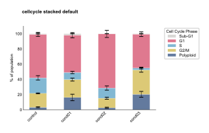
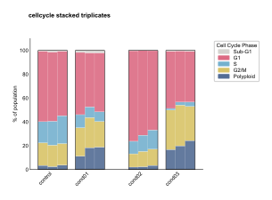
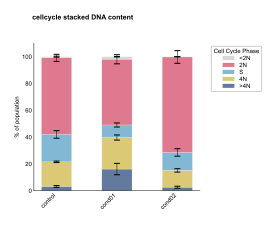
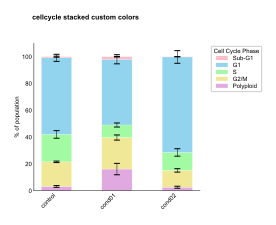
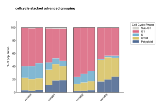

Cell Cycle Stacked API
======================

.. currentmodule:: omero_screen_plots.cellcycleplot_api

The cell cycle stacked plot provides unified visualization of cell cycle phase distributions using stacked bar charts with options for summary statistics or individual biological replicates.

Main Functions
--------------

.. autofunction:: cellcycle_stacked

Examples
--------

Basic Stacked Distribution
~~~~~~~~~~~~~~~~~~~~~~~~~~

Create a standard stacked bar plot showing cell cycle phase proportions with error bars::

    from omero_screen_plots import cellcycle_stacked
    import pandas as pd

    df = pd.read_csv("data.csv")
    fig, ax = cellcycle_stacked(
        df=df,
        conditions=['control', 'cond01', 'cond02', 'cond03'],
        condition_col="condition",
        selector_col="cell_line",
        selector_val="MCF10A",
        title="Cell Cycle Phase Distribution",
        save=True,
        file_format="svg"
    )

Individual Triplicates Display
~~~~~~~~~~~~~~~~~~~~~~~~~~~~~~

Show individual biological replicates to assess experimental consistency::

    fig, ax = cellcycle_stacked(
        df=df,
        conditions=['control', 'cond01', 'cond02', 'cond03'],
        condition_col="condition",
        selector_col="cell_line",
        selector_val="MCF10A",
        display_mode="triplicates",
        group_size=1,
        title="Cell Cycle - Individual Replicates"
    )

DNA Content Focus
~~~~~~~~~~~~~~~~~

Emphasize DNA content measurements with custom phase selection::

    fig, ax = cellcycle_stacked(
        df=df,
        conditions=['control', 'cond01', 'cond02', 'cond03'],
        condition_col="condition",
        selector_col="cell_line",
        selector_val="MCF10A",
        phases=['SubG1', 'G1', 'S', 'G2/M'],
        title="DNA Content Distribution"
    )

Custom Phase Colors
~~~~~~~~~~~~~~~~~~~

Apply custom color schemes for publication figures::

    from omero_screen_plots.colors import COLOR

    phase_colors = [COLOR.LIGHT_BLUE.value, COLOR.BLUE.value,
                    COLOR.GREY.value, COLOR.DARK_GREY.value]

    fig, ax = cellcycle_stacked(
        df=df,
        conditions=['control', 'cond01', 'cond02', 'cond03'],
        condition_col="condition",
        selector_col="cell_line",
        selector_val="MCF10A",
        colors=phase_colors,
        show_legend=True,
        title="Custom Cell Cycle Colors"
    )

Grouped Condition Analysis
~~~~~~~~~~~~~~~~~~~~~~~~~~

Group related conditions for treatment comparison::

    fig, ax = cellcycle_stacked(
        df=df,
        conditions=['control', 'low_dose', 'med_dose', 'high_dose'],
        condition_col="condition",
        selector_col="cell_line",
        selector_val="MCF10A",
        display_mode="triplicates",
        group_size=2,
        within_group_spacing=0.2,
        between_group_gap=0.5,
        title="Dose Response Analysis"
    )

