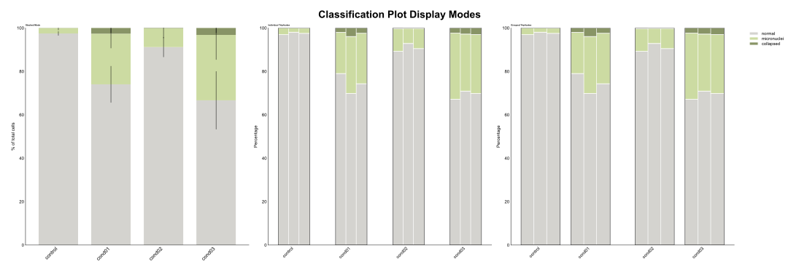

Classification Plot API
========================

.. currentmodule:: omero_screen_plots

The classification plot visualizes categorical classification results across experimental conditions with flexible display modes for stacked percentages or individual biological replicates.

Main Functions
--------------

.. autofunction:: classification_plot

Examples
--------

Basic Stacked Classification
~~~~~~~~~~~~~~~~~~~~~~~~~~~~

Create a standard stacked bar plot showing mean percentages with error bars::

    from omero_screen_plots import classification_plot
    import pandas as pd

    df = pd.read_csv("data.csv")
    fig, ax = classification_plot(
        df=df,
        classes=["normal", "micronuclei", "collapsed"],
        conditions=["control", "treatment1", "treatment2"],
        condition_col="condition",
        class_col="classifier",
        selector_col="cell_line",
        selector_val="MCF10A",
        display_mode="stacked",
        title="Cell Morphology Classification",
        save=True,
        file_format="svg"
    )

Individual Triplicates Display
~~~~~~~~~~~~~~~~~~~~~~~~~~~~~~

Show individual biological replicates to assess experimental consistency::

    fig, ax = classification_plot(
        df=df,
        classes=["normal", "micronuclei", "collapsed"],
        conditions=["control", "treatment1", "treatment2"],
        condition_col="condition",
        class_col="classifier",
        selector_col="cell_line",
        selector_val="MCF10A",
        display_mode="triplicates",
        title="Individual Replicates"
    )

Grouped Conditions
~~~~~~~~~~~~~~~~~~

Group related conditions for easier comparison::

    fig, ax = classification_plot(
        df=df,
        classes=["normal", "micronuclei", "collapsed"],
        conditions=["control", "treatment1", "treatment2", "treatment3"],
        condition_col="condition",
        class_col="classifier",
        selector_col="cell_line",
        selector_val="MCF10A",
        display_mode="triplicates",
        group_size=2,
        title="Grouped Conditions"
    )

Custom Colors
~~~~~~~~~~~~~

Apply custom color schemes to match your classification categories::

    from omero_screen_plots.colors import COLOR

    custom_colors = [COLOR.GREY.value, COLOR.LIGHT_GREEN.value, COLOR.OLIVE.value]

    fig, ax = classification_plot(
        df=df,
        classes=["normal", "micronuclei", "collapsed"],
        conditions=["control", "treatment1", "treatment2"],
        condition_col="condition",
        class_col="classifier",
        selector_col="cell_line",
        selector_val="MCF10A",
        display_mode="stacked",
        colors=custom_colors,
        title="Custom Color Scheme"
    )

Multi-Panel Comparison
~~~~~~~~~~~~~~~~~~~~~~

Create publication-ready figures comparing different display modes::

    import matplotlib.pyplot as plt

    fig, axes = plt.subplots(1, 3, figsize=(15, 5))

    # Stacked mode
    classification_plot(
        df=df, classes=["normal", "micronuclei", "collapsed"],
        conditions=["control", "treatment1", "treatment2"],
        condition_col="condition", class_col="classifier",
        selector_col="cell_line", selector_val="MCF10A",
        display_mode="stacked", show_legend=False, axes=axes[0]
    )
    axes[0].set_title("Stacked Mode", fontweight='bold')

    # Individual triplicates
    classification_plot(
        df=df, classes=["normal", "micronuclei", "collapsed"],
        conditions=["control", "treatment1", "treatment2"],
        condition_col="condition", class_col="classifier",
        selector_col="cell_line", selector_val="MCF10A",
        display_mode="triplicates", group_size=1, axes=axes[1]
    )
    axes[1].set_title("Individual Triplicates", fontweight='bold')

    plt.tight_layout()

