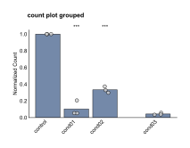

Count Plots
===========

.. currentmodule:: omero_screen_plots

The count plot functionality allows you to analyze and visualize cell counts per well or condition.
This is useful for understanding how different treatments affect cell viability or proliferation.

Quick Start
-----------

Import the function directly from the main package::

    from omero_screen_plots import count_plot, PlotType

Main Function
-------------

.. autofunction:: count_plot

The ``count_plot`` function is the main interface for creating count plots. It handles data processing,
statistical analysis, and visualization in a single function call.

Plot Types
----------

.. currentmodule:: omero_screen_plots.countplot_api

.. autoclass:: PlotType
   :members:
   :undoc-members:

Two plot types are available:

* **PlotType.NORMALISED** (default): Shows counts normalized to the control condition
* **PlotType.ABSOLUTE**: Shows raw cell counts without normalization

Data Requirements
-----------------

The count plot function requires DataFrames with the following essential columns:

* **plate_id**: Identifier for different experimental plates/replicates
* **well**: Well position (e.g., "A01", "B03")
* **experiment**: Experiment identifier
* **condition_col**: Column specified by the user containing experimental conditions

Optional columns for filtering:

* **selector_col**: Column for filtering data (e.g., "cell_line", "time_point")

Basic Usage Examples
--------------------

Normalized count plot (default)::

    import pandas as pd
    from omero_screen_plots import count_plot

    df = pd.read_csv("sample_plate_data.csv")

    # Basic normalized count plot
    fig, ax = count_plot(
        df=df,
        norm_control="control",
        conditions=["control", "cond01", "cond02", "cond03"],
        condition_col="condition",
        selector_col="cell_line",
        selector_val="MCF10A",
        title="count plot basic",
        fig_size=(6, 4),
        size_units="cm",
        save=True,
        path="output/"
    )

.. image:: ../_static/count_plot_basic.svg

Absolute count plot::

    from omero_screen_plots import count_plot, PlotType

    # Absolute count plot
    fig, ax = count_plot(
        df=df,
        norm_control="control",  # Still required for data processing
        conditions=["control", "cond01", "cond02", "cond03"]
        condition_col="condition",
        selector_col="cell_line",
        selector_val="MCF10A",
        plot_type=PlotType.ABSOLUTE,
        title="count plot absolute",
        save=True,
        path="output/"
    )

Grouped layout with custom styling::

    from omero_screen_plots import count_plot

    # Grouped layout for better visual organization
    fig, ax = count_plot(
        df=df,
        norm_control="control",
        conditions=["control", "cond01", "cond02", "cond03"],
        condition_col="condition",
        selector_col="cell_line",
        selector_val="MCF10A",
        group_size=3,  # Group conditions in sets of 3
        within_group_spacing=0.2,
        between_group_gap=0.8,
        fig_size=(10, 6),
        title="Grouped Count Analysis"
    )

Advanced Usage
--------------

Using existing matplotlib axes::

    import matplotlib.pyplot as plt
    from omero_screen_plots import count_plot

    fig, axes = plt.subplots(1, 2, figsize=(4, 2))

    # Plot for cell line 1
    count_plot(
        df=df,
        norm_control="control",
        conditions=["control", "cond01", "cond02", "cond03"],
        condition_col="condition",
        selector_col="cell_line",
        selector_val="MCF10A",
        axes=axes[0],
        plot_type=PlotType.NORMALISED,
        title="MCF10A Norm Counts"
    )

    # Plot for cell line 2
    count_plot(
        df=df,
        norm_control="control",
        conditions=["control", "cond01", "cond02", "cond03"],
        condition_col="condition",
        selector_col="cell_line",
        selector_val="MCF10A",
        plot_type=PlotType.ABSOLUTE,
        axes=axes[1],
        title="MCF10A Abs. Counts"
    )

    plt.tight_layout()
    plt.show()

Complete Parameter Reference
----------------------------

The ``count_plot`` function accepts the following parameters:

Core Parameters
~~~~~~~~~~~~~~~

* **df** (*pandas.DataFrame*): Input DataFrame containing single-cell measurements
* **norm_control** (*str*): Control condition name used for normalization (required even for absolute plots)
* **conditions** (*list[str]*): List of condition names to include in the plot
* **condition_col** (*str, default="condition"*): Column name containing experimental conditions

Data Filtering
~~~~~~~~~~~~~~

* **selector_col** (*str | None, default="cell_line"*): Column name for filtering data by specific values
* **selector_val** (*str | None, default=None*): Specific value to filter by when selector_col is provided

Plot Configuration
~~~~~~~~~~~~~~~~~~

* **plot_type** (*PlotType, default=PlotType.NORMALISED*): Whether to show normalized or absolute counts
* **title** (*str | None, default=None*): Custom plot title (auto-generated if None)
* **colors** (*Any, default=COLOR*): Color scheme for the plot
* **axes** (*matplotlib.axes.Axes | None, default=None*): Existing axes to plot on

Figure Settings
~~~~~~~~~~~~~~~

* **fig_size** (*tuple[float,float], default=(7,7)*): Figure dimensions
* **size_units** (*str, default="cm"*): Units for figure size ("cm" or "inches")
* **dpi** (*int, default=300*): Resolution for saved figures

Layout and Grouping
~~~~~~~~~~~~~~~~~~~

* **group_size** (*int, default=1*): Number of conditions to group together visually
* **within_group_spacing** (*float, default=0.2*): Spacing between bars within a group
* **between_group_gap** (*float, default=0.5*): Gap between different groups
* **x_label** (*bool, default=True*): Whether to show x-axis condition labels

Saving Options
~~~~~~~~~~~~~~

* **save** (*bool, default=False*): Whether to save the figure to disk
* **path** (*Path | None, default=None*): Directory path for saving (required if save=True)
* **file_format** (*str, default="pdf"*): File format for saving ("pdf", "png", "svg")
* **tight_layout** (*bool, default=False*): Whether to apply tight layout before saving

Returns
-------

**tuple[Figure, Axes]**: A tuple containing:
    * **Figure**: The matplotlib Figure object
    * **Axes**: The matplotlib Axes object with the plotted data

Algorithm Details
-----------------

Count Calculation Process
~~~~~~~~~~~~~~~~~~~~~~~~~

1. **Data Filtering**: Filter DataFrame by conditions and optional selector values
2. **Well Counting**: Group by (plate_id, condition, well) and count experiments per well
3. **Mean Calculation**: Calculate mean count per condition across all wells within each plate
4. **Normalization**: If plot_type=NORMALISED, divide all counts by the norm_control value

Statistical Analysis
~~~~~~~~~~~~~~~~~~~

* **Automatic Statistics**: When ≥3 plates are present, statistical significance is calculated
* **Method**: Uses adaptive statistical testing from the stats module
* **Visualization**: Significance levels shown as *, **, *** for p < 0.05, 0.01, 0.001

Error Handling
~~~~~~~~~~~~~~

The function performs comprehensive validation:

* **Required Columns**: Validates presence of plate_id, well, experiment columns
* **Condition Validation**: Ensures all specified conditions exist in the data
* **Control Validation**: Confirms norm_control is included in conditions list
* **Selector Validation**: Validates selector_col exists and selector_val is present
* **Data Availability**: Ensures sufficient data remains after filtering

See Also
--------

* :class:`PlotType`: Enumeration of available plot types (NORMALISED, ABSOLUTE)
* :func:`omero_screen_plots.feature_plot`: For plotting specific measured features
* :func:`omero_screen_plots.cellcycle_plot`: For cell cycle distribution analysis
* :func:`omero_screen_plots.save_fig`: For additional figure saving options
