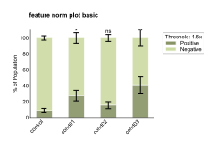
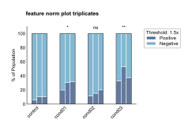
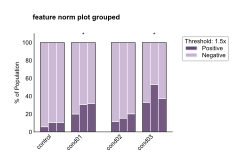
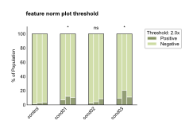
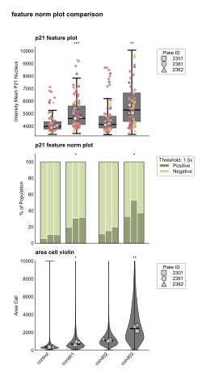

FeatureNormPlot API
==================

.. currentmodule:: omero_screen_plots.featureplot_api

The feature_norm_plot module provides visualization for normalized feature data with threshold-based analysis. These plots normalize data by mode (peak = 1.0) and display the proportion of cells above/below a customizable threshold as stacked bars. They support triplicate display, multiple color schemes, and normalization QC plots.

Main Functions
--------------

.. autofunction:: feature_norm_plot

Examples
--------

Basic Normalized Plot
~~~~~~~~~~~~~~~~~~~~~

Create a basic normalized feature plot with the default green color scheme::

    from omero_screen_plots import feature_norm_plot
    import pandas as pd

    df = pd.read_csv("data.csv")
    fig, ax = feature_norm_plot(
        df=df,
        feature="intensity_mean_p21_nucleus",
        conditions=['control', 'cond01', 'cond02', 'cond03'],
        condition_col="condition",
        selector_col="cell_line",
        selector_val="MCF10A",
        color_scheme="green",
        title="feature norm plot basic",
        show_error_bars=True,
        fig_size=(5, 4),
        save=True,
        file_format="svg"
    )

Triplicates with Blue Color Scheme
~~~~~~~~~~~~~~~~~~~~~~~~~~~~~~~~~~

Show individual triplicate data with boxes using the blue color scheme::

    fig, ax = feature_norm_plot(
        df=df,
        feature="intensity_mean_p21_nucleus",
        conditions=['control', 'cond01', 'cond02', 'cond03'],
        condition_col="condition",
        selector_col="cell_line",
        selector_val="MCF10A",
        color_scheme="blue",
        title="feature norm plot triplicates",
        show_triplicates=True,
        show_boxes=True,
        threshold=1.5,
        fig_size=(5, 4)
    )

Grouped Layout with Purple Scheme
~~~~~~~~~~~~~~~~~~~~~~~~~~~~~~~~~

Use grouped layout for better visual organization with the purple color scheme::

    fig, ax = feature_norm_plot(
        df=df,
        feature="intensity_mean_p21_nucleus",
        conditions=['control', 'cond01', 'cond02', 'cond03'],
        condition_col="condition",
        selector_col="cell_line",
        selector_val="MCF10A",
        color_scheme="purple",
        title="feature norm plot grouped",
        show_triplicates=True,
        show_boxes=True,
        threshold=1.5,
        group_size=2,
        within_group_spacing=0.2,
        between_group_gap=0.4,
        fig_size=(5, 4)
    )

Custom Threshold Analysis
~~~~~~~~~~~~~~~~~~~~~~~~

Adjust the threshold for different sensitivity in detecting positive cells::

    fig, ax = feature_norm_plot(
        df=df,
        feature="intensity_mean_p21_nucleus",
        conditions=['control', 'cond01', 'cond02', 'cond03'],
        condition_col="condition",
        selector_col="cell_line",
        selector_val="MCF10A",
        color_scheme="green",
        title="feature norm plot threshold",
        threshold=2.0,  # Higher threshold (2x mode instead of 1.5x)
        show_triplicates=True,
        show_boxes=True,
        fig_size=(5, 4)
    )

Combined Analysis Comparison
~~~~~~~~~~~~~~~~~~~~~~~~~~~

Create multi-panel figures comparing different analysis approaches::

    import matplotlib.pyplot as plt
    from omero_screen_plots import feature_plot
    from omero_screen_plots.utils import save_fig

    fig, axes = plt.subplots(3, 1, figsize=(2, 6))
    fig.suptitle("feature norm plot comparison", fontsize=8, weight="bold")

    # Standard feature plot
    feature_plot(
        df=df,
        feature="intensity_mean_p21_nucleus",
        conditions=['control', 'cond01', 'cond02', 'cond03'],
        condition_col="condition",
        selector_col="cell_line",
        selector_val="MCF10A",
        x_label=False,
        group_size=2,
        axes=axes[0],
    )
    axes[0].set_title("p21 feature plot", fontsize=7)

    # Normalized feature plot
    feature_norm_plot(
        df=df,
        feature="intensity_mean_p21_nucleus",
        conditions=['control', 'cond01', 'cond02', 'cond03'],
        condition_col="condition",
        selector_col="cell_line",
        selector_val="MCF10A",
        x_label=False,
        axes=axes[1],
        group_size=2,
        show_triplicates=True,
        show_boxes=True,
        threshold=1.5,
    )
    axes[1].set_title("p21 feature norm plot", fontsize=7)

    # Violin plot for comparison
    feature_plot(
        df=df,
        feature="area_cell",
        conditions=['control', 'cond01', 'cond02', 'cond03'],
        condition_col="condition",
        selector_col="cell_line",
        selector_val="MCF10A",
        x_label=True,
        violin=True,
        show_scatter=False,
        ymax=10000,
        axes=axes[2],
        group_size=2,
    )
    axes[2].set_title("area cell violin", fontsize=7)

    save_fig(fig, "output/", "feature_norm_comparison", fig_extension="svg")

Configuration Options
~~~~~~~~~~~~~~~~~~~~

The feature_norm_plot function supports extensive customization:

**Normalization & Thresholding**:

- **Mode normalization**: Data is normalized so the peak (mode) equals 1.0
- **Threshold analysis**: Customizable threshold (default 1.5x mode) for positive/negative classification
- **Plate normalization**: Option to normalize within each plate separately
- **QC plots**: Optional normalization quality control plots showing before/after distributions

**Color Schemes**:

- **Green** (default): Olive for positive cells, light green for negative cells
- **Blue**: Blue for positive cells, light blue for negative cells
- **Purple**: Purple for positive cells, lavender for negative cells

**Display Options**:

- **Summary bars**: Show aggregated proportions across replicates with error bars
- **Triplicate display**: Show individual replicate bars with optional box outlines
- **Grouping**: Organize conditions into groups with custom spacing
- **Threshold legend**: Automatic legend showing threshold value and color mapping

**Layout & Styling**:

- **Figure size**: Control figure dimensions in cm or inches
- **Spacing**: Customize within-group and between-group spacing
- **Labels**: Control axis labels, titles, and legend display
- **Export**: Save in multiple formats (SVG, PDF, PNG) with custom DPI
