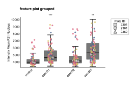

FeaturePlot API
===============

.. currentmodule:: omero_screen_plots.featureplot_api

The featureplot module provides flexible visualization options for comparing quantitative features across experimental conditions. Feature plots support both box plots and violin plots, with optional scatter point overlays, statistical significance testing, and flexible grouping layouts.

Main Functions
--------------

.. autofunction:: feature_plot

Examples
--------

Basic Box Plot
~~~~~~~~~~~~~~

Create a standard box plot with scatter points and statistical significance marks::

    from omero_screen_plots import feature_plot
    import pandas as pd

    df = pd.read_csv("data.csv")
    fig, ax = feature_plot(
        df=df,
        feature="intensity_mean_p21_nucleus",
        conditions=['control', 'cond01', 'cond02', 'cond03'],
        condition_col="condition",
        selector_col="cell_line",
        selector_val="MCF10A",
        title="feature plot basic",
        fig_size=(5, 5),
        save=True,
        file_format="svg"
    )

Grouped Layout
~~~~~~~~~~~~~~

Group conditions for better visual organization and within-group statistical comparisons::

    fig, ax = feature_plot(
        df=df,
        feature="intensity_mean_p21_nucleus",
        conditions=['control', 'cond01', 'cond02', 'cond03'],
        condition_col="condition",
        selector_col="cell_line",
        selector_val="MCF10A",
        title="feature plot grouped",
        group_size=2,
        within_group_spacing=0.2,
        between_group_gap=0.5,
        fig_size=(6, 4)
    )

Violin Plots
~~~~~~~~~~~~

Use violin plots to show the full distribution of your data::

    fig, ax = feature_plot(
        df=df,
        feature="intensity_mean_p21_nucleus",
        conditions=['control', 'cond01', 'cond02', 'cond03'],
        condition_col="condition",
        selector_col="cell_line",
        selector_val="MCF10A",
        title="feature plot violin",
        violin=True,
        ymax=20000,
        fig_size=(5, 5)
    )

Clean Violin Plots
~~~~~~~~~~~~~~~~~~~

Remove scatter points for cleaner visualization with custom y-axis limits::

    fig, ax = feature_plot(
        df=df,
        feature="intensity_mean_p21_nucleus",
        conditions=['control', 'cond01', 'cond02', 'cond03'],
        condition_col="condition",
        selector_col="cell_line",
        selector_val="MCF10A",
        title="feature plot no scatter",
        violin=True,
        show_scatter=False,
        ymax=(2000, 12000),
        group_size=2,
        fig_size=(5, 5)
    )

Combined Subplot Analysis
~~~~~~~~~~~~~~~~~~~~~~~~~

Create multi-panel figures comparing different features::

    import matplotlib.pyplot as plt
    from omero_screen_plots.utils import save_fig

    fig, axes = plt.subplots(2, 1, figsize=(2, 4))
    fig.suptitle("feature plot comparison", fontsize=8, weight="bold")

    # First subplot - p21 intensity
    feature_plot(
        df=df,
        feature="intensity_mean_p21_nucleus",
        conditions=['control', 'cond01', 'cond02', 'cond03'],
        condition_col="condition",
        selector_col="cell_line",
        selector_val="MCF10A",
        axes=axes[0],
        group_size=2,
        x_label=False,
    )
    axes[0].set_title("mean nuc. p21 intensity", fontsize=7)

    # Second subplot - cell area
    feature_plot(
        df=df,
        feature="area_cell",
        conditions=['control', 'cond01', 'cond02', 'cond03'],
        condition_col="condition",
        selector_col="cell_line",
        selector_val="MCF10A",
        violin=True,
        show_scatter=False,
        ymax=10000,
        axes=axes[1],
        group_size=2,
    )
    axes[1].set_title("area cell", fontsize=7)

    save_fig(fig, "output/", "feature_comparison", fig_extension="svg")

