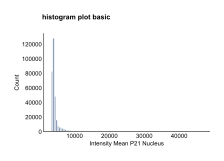

HistogramPlot API
=================

.. currentmodule:: omero_screen_plots.histogramplot_api

The histogramplot module provides comprehensive distribution visualization with support for both traditional histograms and kernel density estimation (KDE) overlays. It offers flexible options for single or multiple conditions, logarithmic scaling, and extensive customization.

Main Functions
--------------

.. autofunction:: histogram_plot

Examples
--------

Basic Single Condition Histogram
~~~~~~~~~~~~~~~~~~~~~~~~~~~~~~~~~

Create a standard histogram for a single condition::

    from omero_screen_plots import histogram_plot
    import pandas as pd

    df = pd.read_csv("data.csv")
    fig, ax = histogram_plot(
        df=df,
        feature="intensity_mean_p21_nucleus",
        conditions="control",  # Single condition as string
        condition_col="condition",
        selector_col="cell_line",
        selector_val="MCF10A",
        bins=100,  # Default value
        title="Basic Histogram",
        show_title=True,
        fig_size=(6, 4),
        save=True,
        file_format="svg"
    )

Multiple Conditions with Subplots
~~~~~~~~~~~~~~~~~~~~~~~~~~~~~~~~~~

Compare distributions across multiple conditions using automatic subplot layout::

    fig, axes = histogram_plot(
        df=df,
        feature="intensity_mean_p21_nucleus",
        conditions=['control', 'cond01', 'cond02', 'cond03'],
        condition_col="condition",
        selector_col="cell_line",
        selector_val="MCF10A",
        bins=50,
        title="Multiple Conditions",
        show_title=True,
        fig_size=(16, 4)  # Automatically sized: 4cm per condition
    )

DNA Content with Log Scale
~~~~~~~~~~~~~~~~~~~~~~~~~~~

Essential for cell cycle analysis using logarithmic scaling::

    fig, axes = histogram_plot(
        df=df,
        feature="integrated_int_DAPI_norm",
        conditions=['control', 'cond01', 'cond02', 'cond03'],
        condition_col="condition",
        selector_col="cell_line",
        selector_val="MCF10A",
        bins=100,
        log_scale=True,
        log_base=2,  # Base 2 for DNA content (2N, 4N)
        x_limits=(1, 16),  # Typical DNA content range
        title="DNA Content Distribution",
        show_title=True
    )

.. image:: ../_static/histogram_integrated_int_DAPI_norm_multi.svg

KDE Overlay Mode
~~~~~~~~~~~~~~~~

Compare multiple conditions on a single plot using smooth density curves::

    fig, ax = histogram_plot(
        df=df,
        feature="integrated_int_DAPI_norm",
        conditions=['control', 'cond01', 'cond02', 'cond03'],
        condition_col="condition",
        selector_col="cell_line",
        selector_val="MCF10A",
        kde_overlay=True,  # Enables KDE-only mode
        kde_smoothing=0.8,  # Smoothing factor
        log_scale=True,
        log_base=2,
        x_limits=(1, 16),
        title="KDE Overlay Comparison",
        show_title=True,
        fig_size=(8, 5)
    )

Normalized Histograms
~~~~~~~~~~~~~~~~~~~~~

Show probability density instead of counts for sample-size-independent comparison::

    fig, axes = histogram_plot(
        df=df,
        feature="area_cell",
        conditions=['control', 'cond01', 'cond02', 'cond03'],
        condition_col="condition",
        selector_col="cell_line",
        selector_val="MCF10A",
        bins=50,
        normalize=True,  # Show density instead of counts
        title="Cell Area Distribution (Normalized)",
        show_title=True
    )

Parameters
----------

The histogram_plot function supports extensive customization:

**Plot Modes**:
- **Standard histograms**: Multiple conditions create separate subplots
- **KDE overlay**: All conditions overlaid on single plot (when ``kde_overlay=True``)

**Scaling Options**:
- **Linear or logarithmic**: Use ``log_scale=True`` with customizable ``log_base``
- **Normalization**: Show density (``normalize=True``) or counts (default)

**Binning Control**:
- **Fixed bins**: Integer value (default: 100)
- **Automatic strategies**: 'auto', 'sturges', 'fd', etc.
- **Unified binning**: Automatic calculation for consistent multi-condition comparison

**KDE Parameters**:
- **Smoothing**: Control with ``kde_smoothing`` (0.5-2.0, default: 0.8)
- **Advanced options**: Pass additional parameters via ``kde_params`` dict
- **Resolution**: Higher ``gridsize`` for smoother curves

**Visual Customization**:
- **Colors**: Default blue for histograms, varied palette for KDE overlay
- **Figure size**: Dynamic defaults based on condition count
- **Titles**: Optional with customizable positioning
- **Axis limits**: Custom x-axis range with ``x_limits``

Key Parameters
~~~~~~~~~~~~~~

Essential parameters for different use cases:

**For Cell Cycle Analysis**::

    histogram_plot(df, "integrated_int_DAPI_norm", conditions,
                   log_scale=True, log_base=2, x_limits=(1, 16))

**For Biomarker Comparison**::

    histogram_plot(df, "intensity_mean_p21_nucleus", conditions,
                   kde_overlay=True, kde_smoothing=0.7)

**For Morphological Features**::

    histogram_plot(df, "area_cell", conditions,
                   normalize=True, bins=50)

Notes on Normalization
~~~~~~~~~~~~~~~~~~~~~~~

When ``normalize=True``, the histogram displays **probability density**:

- Y-axis shows density (probability per unit of x-axis)
- Total area under histogram equals 1.0
- Formula: ``density = count / (total_count * bin_width)``
- Compatible with KDE overlay (which always shows density)

This allows direct comparison of distributions with different sample sizes, essential for conditions with varying cell counts due to toxicity or proliferation effects.

Advanced KDE Customization
~~~~~~~~~~~~~~~~~~~~~~~~~~

Fine-tune KDE generation with the ``kde_params`` dictionary::

    histogram_plot(
        df, feature, conditions,
        kde_overlay=True,
        kde_smoothing=0.6,
        kde_params={
            'gridsize': 500,      # Higher resolution
            'bw_method': 'scott', # Bandwidth selection
            'cut': 3,            # Extend beyond data range
            'alpha': 0.9,        # Transparency
            'linewidth': 3       # Line thickness
        }
    )

**Bandwidth Methods**:
- ``'scott'``: Good general purpose (default)
- ``'silverman'``: Alternative automatic method
- Float value: Manual bandwidth specification

**Smoothing Guidelines**:
- Lower values (0.5-0.7): Smoother, less detailed curves
- Default (0.8): Balanced smoothness and detail
- Higher values (1.5-2.0): More detailed, potentially noisier
