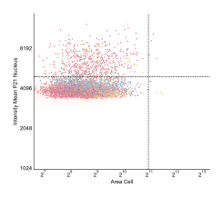
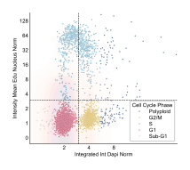

Scatter Plot API
================

.. currentmodule:: omero_screen_plots

.. autofunction:: scatter_plot

The ``scatter_plot`` function provides intelligent scatter plot creation with automatic detection of cell cycle contexts and extensive customization options.

Smart Auto-Detection
---------------------

The function automatically detects plot context based on feature names:

**DNA Content Detection** (``x_feature="integrated_int_DAPI_norm"``)
  - Applies log scale (base 2)
  - Sets x-limits to (1, 16)
  - Adds vertical reference line at x=3
  - Enables cell cycle phase coloring (if available)

**EdU Intensity Detection** (``y_feature="intensity_mean_EdU_nucleus_norm"``)
  - Applies log scale (base 2)
  - Adds horizontal reference line at y=3

**Full Cell Cycle Plot** (DNA + EdU)
  - Enables KDE density overlay
  - Optimizes for cell cycle analysis

**Threshold Override** (when ``threshold`` is specified)
  - Blue points: below threshold
  - Red points: above threshold
  - Overrides cell cycle coloring

Basic Examples
--------------

**Default Cell Cycle Analysis**

.. code-block:: python

    from omero_screen_plots import scatter_plot
    import pandas as pd

    # Load data
    df = pd.read_csv("cell_data.csv")

    # Basic DNA vs EdU scatter plot with auto-detection
    fig, ax = scatter_plot(
        df=df,
        conditions="control",
        condition_col="condition",
        selector_col="cell_line",
        selector_val="MCF10A",
        cell_number=3000
    )

.. image:: ../_static/scatter_plot_basic.svg
   :alt: Basic scatter plot example

**Multiple Conditions**

.. code-block:: python

    # Compare multiple treatments
    conditions = ["control", "treatment1", "treatment2"]

    fig, axes = scatter_plot(
        df=df,
        conditions=conditions,  # Creates subplots
        condition_col="condition",
        selector_col="cell_line",
        selector_val="MCF10A",
        cell_number=2000,
        title="Treatment Comparison",
        show_title=True
    )

.. image:: ../_static/scatter_plot_multiple.svg
   :alt: Multiple condition scatter plot example

**Threshold Analysis**

.. code-block:: python

    # Biomarker analysis with threshold coloring
    fig, axes = scatter_plot(
        df=df,
        y_feature="intensity_mean_p21_nucleus",
        conditions=conditions,
        condition_col="condition",
        selector_col="cell_line",
        selector_val="MCF10A",
        threshold=5000,  # Blue below, red above
        y_limits=(1000, 12000),
        title="p21 Expression Analysis"
    )

.. image:: ../_static/scatter_plot_threshold.svg
   :alt: Threshold-based scatter plot example

Advanced Configuration
-----------------------

**Custom Scales and Reference Lines**

.. code-block:: python

    # Override auto-detection
    fig, ax = scatter_plot(
        df=df,
        x_feature="area_cell",
        y_feature="intensity_mean_p21_nucleus",
        conditions="control",
        x_scale="log",  # Force log scale
        y_scale="log",
        x_limits=(100, 10000),
        y_limits=(1000, 15000),
        vline=2000,  # Custom reference lines
        hline=5000,
        kde_overlay=True
    )

**KDE Overlay Customization**

.. code-block:: python

    # Control density overlay appearance
    fig, ax = scatter_plot(
        df=df,
        conditions="control",
        kde_overlay=True,
        kde_alpha=0.2,  # Subtle overlay
        kde_cmap="viridis",  # Custom colormap
        cell_number=5000
    )

**Manual Cell Cycle Control**

.. code-block:: python

    # Explicit cell cycle phase settings
    fig, ax = scatter_plot(
        df=df,
        conditions="control",
        hue="cell_cycle",
        hue_order=["Sub-G1", "G1", "S", "G2/M", "Polyploid"],
        show_legend=True,
        legend_title="Cell Cycle Phase",
        cell_number=4000
    )

Parameter Categories
--------------------

**Data Selection**
  - ``df``: Input DataFrame
  - ``conditions``: Single condition (str) or multiple (list)
  - ``condition_col``: Condition column name
  - ``selector_col/selector_val``: Additional filtering
  - ``cell_number``: Sampling size (for performance)

**Features and Scales**
  - ``x_feature/y_feature``: Column names for axes
  - ``x_scale/y_scale``: "linear" or "log" (auto-detected)
  - ``x_limits/y_limits``: Axis ranges
  - ``x_ticks/y_ticks``: Custom tick positions

**Coloring and Styling**
  - ``hue``: Color grouping column (auto: "cell_cycle")
  - ``hue_order``: Custom category order
  - ``palette``: Custom color scheme
  - ``threshold``: Y-value for blue/red coloring
  - ``size``: Point size (1-5, default: 2)
  - ``alpha``: Point transparency (0-1)

**KDE Density Overlay**
  - ``kde_overlay``: Enable density contours (auto for DNA vs EdU)
  - ``kde_alpha``: Overlay transparency (0.1-0.6)
  - ``kde_cmap``: Density colormap

**Reference Lines and Layout**
  - ``vline/hline``: Reference line positions (auto for DNA/EdU)
  - ``line_style/line_color``: Line appearance
  - ``grid``: Show background grid
  - ``show_title``: Display plot title
  - ``show_legend``: Display color legend

**Figure Control**
  - ``fig_size``: Figure dimensions (auto: 4cm per condition)
  - ``axes``: Plot on existing matplotlib Axes
  - ``save``: Save to file
  - ``path``: Save directory

Performance Considerations
---------------------------

**Cell Sampling Guidelines**

The ``cell_number`` parameter controls performance vs quality:

- **Fast preview**: 1000-2000 cells
- **Standard analysis**: 3000-5000 cells
- **Publication quality**: 8000-15000 cells
- **Maximum detail**: 20000+ cells

**Memory Optimization**

- Large datasets (>100k cells): Always use sampling
- Multiple conditions: Reduce cells per condition
- KDE overlay: Adds computational cost
- High cell numbers: Use lower ``alpha`` values

**Visualization Tips**

- High density data: ``size=1, alpha=0.3``
- Low density data: ``size=3, alpha=0.8``
- Publication plots: ``cell_number=10000+``
- Interactive analysis: ``cell_number=2000``

Integration Examples
--------------------

**With Matplotlib Subplots**

.. code-block:: python

    import matplotlib.pyplot as plt

    # Create custom layout
    fig, axes = plt.subplots(2, 2, figsize=(10, 8))

    # Plot on each subplot
    scatter_plot(df, "control", axes=axes[0,0])
    scatter_plot(df, "treatment", axes=axes[0,1])
    scatter_plot(df, "control", threshold=5000, axes=axes[1,0])
    scatter_plot(df, "treatment", threshold=5000, axes=axes[1,1])

    plt.tight_layout()

**Saving and Export**

.. code-block:: python

    from pathlib import Path

    # Save with custom settings
    scatter_plot(
        df=df,
        conditions=["control", "treatment"],
        title="Cell Cycle Comparison",
        save=True,
        path=Path("output/figures"),
        file_format="pdf",
        dpi=300
    )

Return Values
-------------

The function returns different values based on input:

- **Single condition**: ``(Figure, Axes)``
- **Multiple conditions**: ``(Figure, list[Axes])``
- **With axes parameter**: ``(Figure, Axes)`` (provided axes)

Error Handling
--------------

Common error scenarios:

- **Missing columns**: Validates feature and condition columns exist
- **Empty data**: Checks for data after filtering
- **Multiple conditions + axes**: Not supported (raises ValueError)
- **Invalid parameters**: Type checking for scales, limits, etc.

See Also
--------

- :doc:`scatter_plot_examples`: Detailed usage examples
- :doc:`histogramplot`: Related histogram visualization
- :doc:`cellcycleplot`: Cell cycle-specific plotting
- :doc:`featureplot`: Feature distribution analysis
