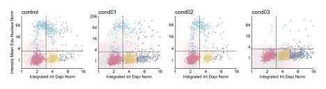

Scatter Plot API
================

.. currentmodule:: omero_screen_plots

The scatter plot provides intelligent visualization for exploring relationships between two quantitative features with automatic context detection for cell cycle analysis and extensive customization options.

Main Functions
--------------

.. autofunction:: scatter_plot

Examples
--------

Basic Feature Correlation
~~~~~~~~~~~~~~~~~~~~~~~~~

Create a standard scatter plot to explore relationships between two features::

    from omero_screen_plots import scatter_plot
    import pandas as pd

    df = pd.read_csv("data.csv")
    fig, ax = scatter_plot(
        df=df,
        x_feature="area_cell",
        y_feature="intensity_mean_p21_nucleus",
        conditions=['control', 'cond01', 'cond02', 'cond03'],
        condition_col="condition",
        selector_col="cell_line",
        selector_val="MCF10A",
        title="Cell Area vs p21 Intensity",
        save=True,
        file_format="svg"
    )

Multiple Condition Comparison
~~~~~~~~~~~~~~~~~~~~~~~~~~~~~

Compare feature relationships across different experimental conditions::

    fig, ax = scatter_plot(
        df=df,
        x_feature="area_cell",
        y_feature="intensity_mean_p21_nucleus",
        conditions=['control', 'cond01', 'cond02', 'cond03'],
        condition_col="condition",
        selector_col="cell_line",
        selector_val="MCF10A",
        multi_condition=True,
        title="Multi-Condition Feature Analysis"
    )

Cell Cycle Context Detection
~~~~~~~~~~~~~~~~~~~~~~~~~~~~

Automatic cell cycle visualization with DNA content and EdU incorporation::

    fig, ax = scatter_plot(
        df=df,
        x_feature="integrated_int_DAPI_norm",  # Auto-detected as DNA content
        y_feature="intensity_mean_EdU_nucleus_norm",  # Auto-detected as EdU
        conditions=['control', 'cond01', 'cond02'],
        condition_col="condition",
        selector_col="cell_line",
        selector_val="MCF10A",
        title="Cell Cycle Analysis"
    )

.. image:: ../_static/scatter_plot_phases.svg

Threshold Analysis
~~~~~~~~~~~~~~~~~~

Apply threshold-based classification with custom coloring::

    fig, ax = scatter_plot(
        df=df,
        x_feature="area_cell",
        y_feature="intensity_mean_p21_nucleus",
        conditions=['control', 'treatment'],
        condition_col="condition",
        selector_col="cell_line",
        selector_val="MCF10A",
        threshold=5000,  # Threshold value for y-axis
        title="Threshold-Based Classification"
    )

.. image:: ../_static/scatter_plot_threshold.svg

KDE Density Overlay
~~~~~~~~~~~~~~~~~~~

Add kernel density estimation for distribution visualization::

    fig, ax = scatter_plot(
        df=df,
        x_feature="integrated_int_DAPI_norm",
        y_feature="intensity_mean_EdU_nucleus_norm",
        conditions=['control'],
        condition_col="condition",
        selector_col="cell_line",
        selector_val="MCF10A",
        add_kde=True,
        title="Density Distribution Analysis"
    )

.. image:: ../_static/scatter_plot_kde.svg
