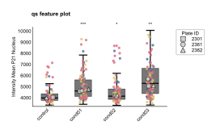

# Quick Start Guide

This guide will help you create your first plots with OmeroScreen Plots using example data.

## Download Example Data

First, let's download the example dataset from Zenodo to test the different plot types:

```bash
# Navigate to the examples data directory
cd packages/omero-screen-plots/src/omero_screen_plots/examples/data

# Download the example dataset from Zenodo
wget https://zenodo.org/records/15728770/files/sample_plate_data.csv

# Or using curl
curl -L -o sample_plate_data.csv https://zenodo.org/records/15728770/files/sample_plate_data.csv
```

This dataset contains single-cell measurements from a high-content screening experiment with multiple conditions and features.

## Basic Workflow

1. **Load example data**: Use the downloaded CSV file
2. **Choose a plot type**: Based on your analysis needs
3. **Create and customize**: Generate publication-ready figures
4. **Save and export**: Multiple format options

## Data Format

The example data includes these key columns:

- **object_id**: Unique identifier for each cell
- **condition**: Experimental condition (e.g., "DMSO", "Nutlin", "Etop", "Noc")
- **plate_id**: Plate identifier
- **well_name**: Well position (e.g., "C04", "D04")
- **Feature columns**: Various measurements including:
  - `intensity_mean_dapi_nucleus`: DAPI intensity
  - `intensity_integrated_edu_nucleus`: EdU incorporation
  - `intensity_mean_p21_nucleus`: p21 expression
  - `area_nucleus`: Nuclear area
  - And many more...

## Plot Types

We have build a variety of function for standardized single cell analysis.
This included plotting measurments of specific aparmeters such as mean intensity or cell area
as well as cellcycle and cell count plotting. These types of plots include
statistical analysis if at least three diferent data sets are present in the dataframe.
Combined plots display cell cycle profiles in more detail using scatterplots.

### 1. Count Plots

Count plots are the simplest type of analysis of the OmeroScreen IF data. They simply
display the differences in cell count and provide a statistical analysis.

```python
from omero_screen_plots import count_plot

# Generate count plot
fig, ax = count_plot(
    df=df,
    norm_control="control",
    conditions=['control', 'cond01', 'cond02', 'cond03'],
    condition_col="condition",
    selector_col='cell_line',
    selector_val='MCF10A',
    title="Cell Count per Condition",
    save=True,
    path="_static"  # Save to docs _static directory
)
```


### 2. Feature Plots

Feature plots display single cell measurements for a chosen parameter provided by the
feature argument. Below is a standard example using an overlay of boxen and stripplots
and also displaying the median of individual repeats in the data set with t-tests performed
relative to the control (the first column by default)

```python
from omero_screen_plots import feature_plot

# Generate feature plot
fig, ax = feature_plot(
    df=df,
    feature="intensity_mean_p21_nucleus",
    conditions=['control', 'cond01', 'cond02', 'cond03'],
    condition_col="condition",
    selector_col='cell_line',
    selector_val='MCF10A',
    title="p21 Expression by Condition",
    fig_size=(5, 3),
    save=True,
    path="_static"  # Save to docs _static directory
)
```



### 3. Cell Cycle Plots

Cellcycle plots require EdU staining in the dataset, and are calculated using an
automated normalisation and thresholding procedure. There are several variations in the
display options, below is a stacked barplot example.

*Note: The cell cycle plot requires EdU staining data. If your dataset doesn't contain the required EdU columns, this plot may not display correctly.*

```python
from omero_screen_plots import cellcycle_stacked

# Generate cell cycle plot (requires EdU data)

fig, ax = cellcycle_stacked(
    df=df,
    conditions=['control', 'cond01', 'cond02', 'cond03'],
    condition_col="condition",
    selector_col='cell_line',
    selector_val='MCF10A',
    y_err=True,
    title="Stacked Cell Cycle Plot",
    fig_size=(6, 3),
    size_units="cm",
    between_group_gap=0.4,
    save=True,
    path="_static"  # Save to docs _static directory
)
```


## Running the Example Notebooks

The package includes Jupyter notebooks demonstrating various analyses:

```bash
# Navigate to the examples directory
cd packages/omero-screen-plots/src/omero_screen_plots/examples/notebooks

# Start Jupyter
jupyter notebook

# Open and run the example notebooks:
# - featureplot.ipynb
# - cellcycle.ipynb
# - combplot.ipynb
# - normalise.ipynb
```

## Common Parameters

Most plot classes share these parameters:

- **data_path**: Path to your CSV file
- **conditions**: List of conditions to plot
- **condition_col**: Column name containing conditions
- **plate_ids**: Optional list to filter specific plates
- **output_path**: Directory for saving figures
- **fig_format**: Output format ("pdf", "png", "svg")
- **dpi**: Resolution for raster formats

## Statistical Analysis

The example data demonstrates automatic statistical testing:

```python
# Feature plot with statistics
plot = FeaturePlot(
    data_path="sample_plate_data.csv",
    y_feature="intensity_mean_p21_nucleus",
    conditions=["DMSO", "Nutlin", "Etop", "Noc"],
    condition_col="condition",
    test_group_pairs=[("DMSO", "Nutlin"), ("DMSO", "Etop"), ("DMSO", "Noc")]
)
```

## Customization Examples

### Custom Colors

```python
# Use custom colors for conditions
plot = FeaturePlot(
    data_path="sample_plate_data.csv",
    y_feature="intensity_mean_p21_nucleus",
    conditions=["DMSO", "Nutlin", "Etop", "Noc"],
    condition_col="condition",
    order_and_colors={
        "DMSO": "#1f77b4",
        "Nutlin": "#ff7f0e",
        "Etop": "#2ca02c",
        "Noc": "#d62728"
    }
)
```

### Grouped Conditions

```python
# Group conditions visually
plot = FeaturePlot(
    data_path="sample_plate_data.csv",
    y_feature="intensity_mean_p21_nucleus",
    conditions=["DMSO", "Nutlin", "Etop", "Noc"],
    condition_col="condition",
    grouped=True,
    group_names=["Control", "DNA Damage"]
)
```

## Tips for Using Example Data

1. **Explore the data**: Check what features are available in the CSV
2. **Try different features**: The example data has many measured parameters
3. **Experiment with conditions**: Try different subsets of the four conditions
4. **Test plot types**: Each plot type reveals different aspects of the data
5. **Check the notebooks**: Example notebooks show real-world usage patterns

## Next Steps

- Explore [Plot Types](plot_types.md) for all available visualizations
- Learn about [Customization](customization.md) options
- See [Example Notebooks](examples/basic_plots.md) for detailed tutorials
- Try your own data following the same format as the example dataset
