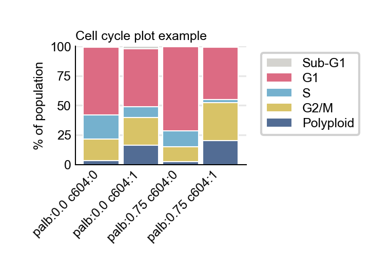
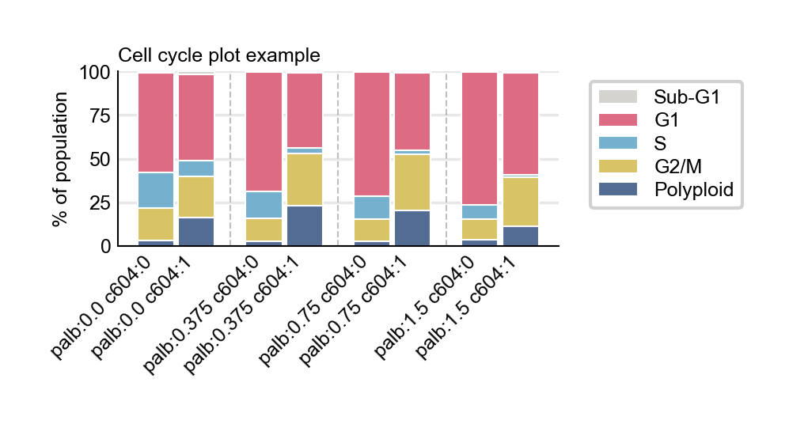
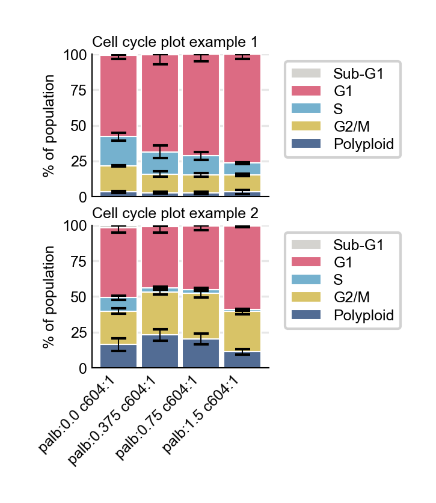

# Cell Cycle Plot – Stacked Example

This example showcases how to generate a **stacked bar chart** of cell-cycle phase proportions with the `omero-screen-plots` package.

---

## 1. Requirements

```bash
# install from the repo root
uv pip install -e .
```

The example was tested with **Python 3.12** and `omero-screen-plots` ≥ 0.1.3-alpha.

> **Note** `omero-screen-plots` installs `pandas`, `matplotlib`, `seaborn`, and `scipy` automatically as dependencies.

---

## 2. Retrieve the sample dataset

The CSV used below is hosted on **Zenodo** (DOI `10.5281/zenodo.15728770`).

```bash
mkdir -p data && cd data
wget https://zenodo.org/records/15728770/files/omero-screen-plots-sampledata.csv?download=1 -O sample_plate_data.csv
cd ..
```

Alternatively download the file via your browser and place it in a local `data/` folder.

---

## 3. Minimal code example

```python
import pandas as pd
from omero_screen_plots import cellcycle_stacked_plot

# 1) Load the data
csv_path = "data/sample_plate_data.csv"
df = pd.read_csv(csv_path)

# 2) Specify the order of experimental conditions (x-axis order matters)
conditions = [
    "palb:0.0 c604:0",
    "palb:0.0 c604:1",
    "palb:0.75 c604:0",
    "palb:0.75 c604:1",
]

# 3) Generate the stacked plot
fig = cellcycle_stacked_plot(
    data=df,
    conditions=conditions,
    condition_col="condition",
    selector_col="cell_line",
    selector_val="RPE1wt",
    title="Cell-cycle distribution – stacked",
    figsize=(4, 2),
    show_error_bars=False,
)

```

Running the snippet above creates an image similar to:




---

## 4. Grouping larger condition sets

`cellcycle_stacked_plot` can visually group conditions (e.g. drug ± co-treatment) to keep long x-axes readable:

```python
conditions = [
    "palb:0.0 c604:0",
    "palb:0.0 c604:1",
    "palb:0.375 c604:0",
    "palb:0.375 c604:1",
    "palb:0.75 c604:0",
    "palb:0.75 c604:1",
    "palb:1.5 c604:0",
    "palb:1.5 c604:1",
]

fig = cellcycle_stacked_plot(
    data=df,
    conditions=conditions,
    selector_val="MCF10A",
    group_size=2,             # put ±co-treatment next to each other
    between_group_gap=1.0,    # add extra space between dose groups
)
```
Running the snippet above creates an image similar to:




---

## 5. Embedding in multi-panel figures

Because the function accepts an optional `ax` argument it integrates nicely with `matplotlib` grids:

```python
import matplotlib.pyplot as plt

condition_sets = [cond_list_A, cond_list_B]
fig, axes = plt.subplots(nrows=len(condition_sets), ncols=1, figsize=(3, 6))

for idx, (ax, conds) in enumerate(zip(axes, condition_sets)):
    cellcycle_stacked_plot(
        data=df,
        conditions=conds,
        selector_val="MCF10A",
        ax=ax,
        show_x_label=(idx == len(axes) - 1),  # show x-labels only on bottom row
    )
```

---
## Complete set of arguments:
data: DataFrame containing cell cycle data with required columns:
        - 'cell_cycle': Cell cycle phase for each cell
        - 'plate_id': Plate/replicate identifier
        - 'experiment': Unique cell identifier
        - condition_col: Column containing experimental conditions
        - selector_col: Column for data selection (e.g., cell_line)
conditions: List of experimental conditions to plot

### Data filtering arguments
condition_col: Name of column containing experimental conditions
selector_col: Name of column for data filtering (e.g., 'cell_line')
selector_val: Value to filter by in selector_col (e.g., 'RPE-1')

### Plot appearance arguments
title: Overall plot title. If None, auto-generated from selector_val
colors: Custom color palette. If None, uses default from config
figsize: Figure size as (width, height) in inches. If None, uses default
phases: List of cell cycle phases to plot. If None, uses default order ["SubG1", "G1", "S", "G2/M", "Polyploid"]

### Stacked plot specific arguments
reverse_stack: If True, reverse the stacking order of phases
show_legend: Whether to show the phase legend
legend_position: Legend position ("right", "bottom", "top", "left")
group_size: If >0, arrange conditions into visual groups of this size
within_group_spacing: Spacing between conditions inside a group
between_group_gap: Extra space between consecutive groups
bar_width: Optional bar width for each bar
show_error_bars: If True, draw standard-deviation error bars on each segment
error_bar_capsize: Size of the error-bar caps
error_bar_color: Color of the error-bar lines

### Integration arguments
ax: Optional matplotlib axes to plot on. If provided, creates subplot
show_x_label: Whether to show the x-axis label

### Output arguments
save: Whether to save the figure to file
output_path: Directory or full path for saving. Required if save=True
filename: Specific filename. If None, auto-generated based on parameters

### Save quality arguments
dpi: Resolution for saved figure (dots per inch)
file_format: File format ('pdf', 'png', 'svg', etc.)
tight_layout: Whether to apply tight layout before saving

**kwargs: Additional arguments passed to the base class
## 6. Troubleshooting

* **ValueError: Unknown column names** – verify `condition_col` / `selector_col` match your CSV headers.
* **Nothing shown / blank bars** – check that `selector_val` exists in the specified `selector_col`.
* **Bars overlap** – adjust `bar_width`, `within_group_spacing`, or `between_group_gap`.

---

© 2025 • Helfrid Hochegger – Released under the MIT License
