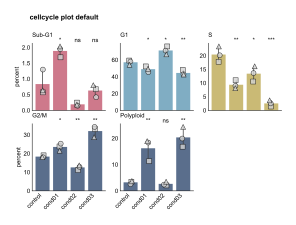
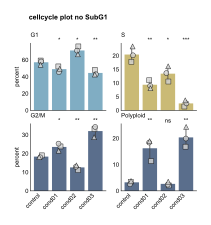
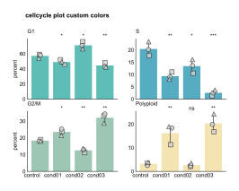

```{=html}
<style>
/* Scientific figures are line art on a transparent background: black text
   disappears on a dark page. Rather than maintaining a second set of dark
   figures, render them on a light card in both themes, so the published
   colours stay exactly as they appear in the paper. */
.fig-card {
  background: #ffffff;
  border: 1px solid rgba(0, 0, 0, 0.10);
  border-radius: 10px;
  padding: 1.25rem 1.25rem 0.5rem;
  margin: 1.75rem 0;
  box-shadow: 0 1px 4px rgba(0, 0, 0, 0.08);
}
.fig-card img { display: block; margin: 0 auto; max-width: 100%; height: auto; }
.fig-card figure { margin: 0; }
.fig-card figcaption {
  color: #3a3a3a;
  font-size: 0.86rem;
  line-height: 1.45;
  padding-top: 0.75rem;
}
</style>
```

The cell cycle plot provides comprehensive visualization of cell cycle phase distributions across experimental conditions in a multi-panel grid layout with statistical analysis and flexible phase terminology.

See the [API reference](../reference/index.html) for full signatures and parameter documentation.

## Examples

### Default Cell Cycle Analysis

Create a standard 2x3 grid showing all cell cycle phases with statistical analysis:

```python
from omero_screen_plots import cellcycle_plot
import pandas as pd

df = pd.read_csv("data.csv")
fig, axes = cellcycle_plot(
    df=df,
    conditions=['control', 'cond01', 'cond02', 'cond03'],
    condition_col="condition",
    selector_col="cell_line",
    selector_val="MCF10A",
    title="Cell Cycle Analysis",
    save=True,
    file_format="svg"
)
```

::: {.fig-card}

:::

### DNA Content Visualization

Focus on DNA content measurements with 2x2 grid layout:

```python
fig, axes = cellcycle_plot(
    df=df,
    conditions=['control', 'cond01', 'cond02', 'cond03'],
    condition_col="condition",
    selector_col="cell_line",
    selector_val="MCF10A",
    cc_phases=False,  # Use DNA content terminology (<2N, 2N, S, 4N, >4N)
    title="DNA Content Analysis"
)
```

::: {.fig-card}

:::

### Custom Phase Selection

Analyze specific cell cycle phases with custom terminology:

```python
fig, axes = cellcycle_plot(
    df=df,
    conditions=['control', 'cond01', 'cond02', 'cond03'],
    condition_col="condition",
    selector_col="cell_line",
    selector_val="MCF10A",
    cc_phases=True,
    show_subG1=False,  # Exclude SubG1
    title="Major Cell Cycle Phases"
)
```

::: {.fig-card}

:::

### Clean Layout with Custom Colors

Create publication-ready figures with custom styling:

```python
from omero_screen_plots.colors import COLOR

custom_colors = [COLOR.LIGHT_BLUE.value, COLOR.BLUE.value,
                 COLOR.GREY.value, COLOR.DARK_GREY.value]

fig, axes = cellcycle_plot(
    df=df,
    conditions=['control', 'cond01', 'cond02', 'cond03'],
    condition_col="condition",
    selector_col="cell_line",
    selector_val="MCF10A",
    show_subG1=True,
    colors=custom_colors,
    show_repeat_points=False,
    title="Custom Styled Cell Cycle"
)
```

::: {.fig-card}

:::
