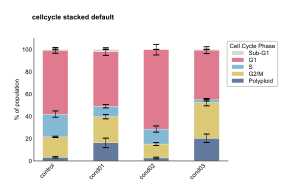
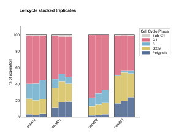
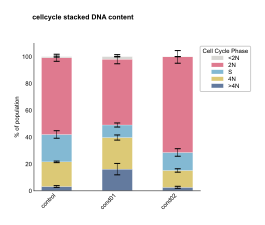
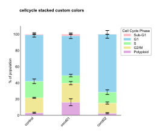
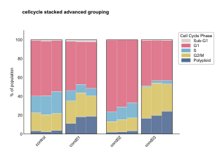

```{=html}
<style>
/* Scientific figures are line art on a transparent background: black text
   disappears on a dark page. Rather than maintaining a second set of dark
   figures, render them on a light card in both themes, so the published
   colours stay exactly as they appear in the paper. */
.fig-card {
  background: #ffffff;
  border: 1px solid rgba(0, 0, 0, 0.10);
  border-radius: 10px;
  padding: 1.25rem 1.25rem 0.5rem;
  margin: 1.75rem 0;
  box-shadow: 0 1px 4px rgba(0, 0, 0, 0.08);
}
.fig-card img { display: block; margin: 0 auto; max-width: 100%; height: auto; }
.fig-card figure { margin: 0; }
.fig-card figcaption {
  color: #3a3a3a;
  font-size: 0.86rem;
  line-height: 1.45;
  padding-top: 0.75rem;
}
</style>
```

The cell cycle stacked plot provides unified visualization of cell cycle phase distributions using stacked bar charts with options for summary statistics or individual biological replicates.

See the [API reference](../reference/index.html) for full signatures and parameter documentation.

## Examples

### Basic Stacked Distribution

Create a standard stacked bar plot showing cell cycle phase proportions with error bars:

```python
from omero_screen_plots import cellcycle_stacked
import pandas as pd

df = pd.read_csv("data.csv")
fig, ax = cellcycle_stacked(
    df=df,
    conditions=['control', 'cond01', 'cond02', 'cond03'],
    condition_col="condition",
    selector_col="cell_line",
    selector_val="MCF10A",
    title="Cell Cycle Phase Distribution",
    save=True,
    file_format="svg"
)
```

::: {.fig-card}

:::

### Individual Triplicates Display

Show individual biological replicates to assess experimental consistency:

```python
fig, ax = cellcycle_stacked(
    df=df,
    conditions=['control', 'cond01', 'cond02', 'cond03'],
    condition_col="condition",
    selector_col="cell_line",
    selector_val="MCF10A",
    selector_val="MCF10A",
    show_triplicates=True,
    group_size=1,
    title="Cell Cycle - Individual Replicates"
)
```

::: {.fig-card}

:::

### DNA Content Focus

Emphasize DNA content measurements with custom phase selection:

```python
fig, ax = cellcycle_stacked(
    df=df,
    conditions=['control', 'cond01', 'cond02', 'cond03'],
    condition_col="condition",
    selector_col="cell_line",
    selector_val="MCF10A",
    selector_val="MCF10A",
    phase_order=['SubG1', 'G1', 'S', 'G2/M'],
    title="DNA Content Distribution"
)
```

::: {.fig-card}

:::

### Custom Phase Colors

Apply custom color schemes for publication figures:

```python
from omero_screen_plots.colors import COLOR

phase_colors = [COLOR.LIGHT_BLUE.value, COLOR.BLUE.value,
                COLOR.GREY.value, COLOR.DARK_GREY.value]

fig, ax = cellcycle_stacked(
    df=df,
    conditions=['control', 'cond01', 'cond02', 'cond03'],
    condition_col="condition",
    selector_col="cell_line",
    selector_val="MCF10A",
    colors=phase_colors,
    show_legend=True,
    title="Custom Cell Cycle Colors"
)
```

::: {.fig-card}

:::

### Grouped Condition Analysis

Group related conditions for treatment comparison:

```python
fig, ax = cellcycle_stacked(
    df=df,
    conditions=['control', 'low_dose', 'med_dose', 'high_dose'],
    condition_col="condition",
    selector_col="cell_line",
    selector_val="MCF10A",
    show_triplicates=True,
    group_size=2,
    within_group_spacing=0.2,
    between_group_gap=0.5,
    title="Dose Response Analysis"
)
```

::: {.fig-card}

:::
