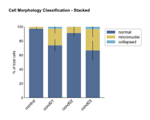
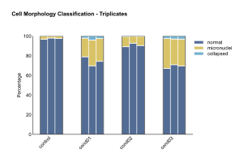
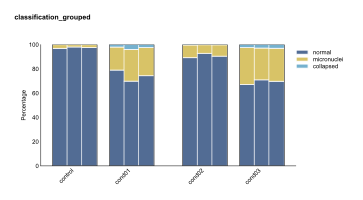
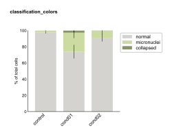
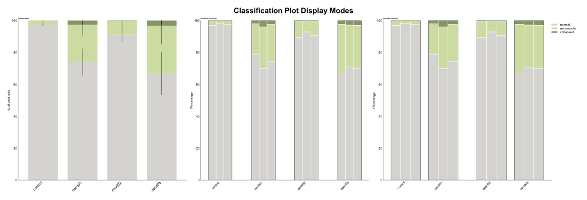

```{=html}
<style>
/* Scientific figures are line art on a transparent background: black text
   disappears on a dark page. Rather than maintaining a second set of dark
   figures, render them on a light card in both themes, so the published
   colours stay exactly as they appear in the paper. */
.fig-card {
  background: #ffffff;
  border: 1px solid rgba(0, 0, 0, 0.10);
  border-radius: 10px;
  padding: 1.25rem 1.25rem 0.5rem;
  margin: 1.75rem 0;
  box-shadow: 0 1px 4px rgba(0, 0, 0, 0.08);
}
.fig-card img { display: block; margin: 0 auto; max-width: 100%; height: auto; }
.fig-card figure { margin: 0; }
.fig-card figcaption {
  color: #3a3a3a;
  font-size: 0.86rem;
  line-height: 1.45;
  padding-top: 0.75rem;
}
</style>
```

The classification plot visualizes categorical classification results across experimental conditions with flexible display modes for stacked percentages or individual biological replicates.

See the [API reference](../reference/index.html) for full signatures and parameter documentation.

## Examples

### Basic Stacked Classification

Create a standard stacked bar plot showing mean percentages with error bars:

```python
from omero_screen_plots import classification_plot
import pandas as pd

df = pd.read_csv("data.csv")
fig, ax = classification_plot(
    df=df,
    classes=["normal", "micronuclei", "collapsed"],
    conditions=["control", "treatment1", "treatment2"],
    condition_col="condition",
    class_col="classifier",
    selector_col="cell_line",
    selector_val="MCF10A",
    display_mode="stacked",
    title="Cell Morphology Classification",
    save=True,
    file_format="svg"
)
```

::: {.fig-card}

:::

### Individual Triplicates Display

Show individual biological replicates to assess experimental consistency:

```python
fig, ax = classification_plot(
    df=df,
    classes=["normal", "micronuclei", "collapsed"],
    conditions=["control", "treatment1", "treatment2"],
    condition_col="condition",
    class_col="classifier",
    selector_col="cell_line",
    selector_val="MCF10A",
    display_mode="triplicates",
    title="Individual Replicates"
)
```

::: {.fig-card}

:::

### Grouped Conditions

Group related conditions for easier comparison:

```python
fig, ax = classification_plot(
    df=df,
    classes=["normal", "micronuclei", "collapsed"],
    conditions=["control", "treatment1", "treatment2", "treatment3"],
    condition_col="condition",
    class_col="classifier",
    selector_col="cell_line",
    selector_val="MCF10A",
    display_mode="triplicates",
    group_size=2,
    title="Grouped Conditions"
)
```

::: {.fig-card}

:::

### Custom Colors

Apply custom color schemes to match your classification categories:

```python
from omero_screen_plots.colors import COLOR

custom_colors = [COLOR.GREY.value, COLOR.LIGHT_GREEN.value, COLOR.OLIVE.value]

fig, ax = classification_plot(
    df=df,
    classes=["normal", "micronuclei", "collapsed"],
    conditions=["control", "treatment1", "treatment2"],
    condition_col="condition",
    class_col="classifier",
    selector_col="cell_line",
    selector_val="MCF10A",
    display_mode="stacked",
    colors=custom_colors,
    title="Custom Color Scheme"
)
```

::: {.fig-card}

:::

### Multi-Panel Comparison

Create publication-ready figures comparing different display modes:

```python
import matplotlib.pyplot as plt

fig, axes = plt.subplots(1, 3, figsize=(15, 5))

# Stacked mode
classification_plot(
    df=df, classes=["normal", "micronuclei", "collapsed"],
    conditions=["control", "treatment1", "treatment2"],
    condition_col="condition", class_col="classifier",
    selector_col="cell_line", selector_val="MCF10A",
    display_mode="stacked", show_legend=False, axes=axes[0]
)
axes[0].set_title("Stacked Mode", fontweight='bold')

# Individual triplicates
classification_plot(
    df=df, classes=["normal", "micronuclei", "collapsed"],
    conditions=["control", "treatment1", "treatment2"],
    condition_col="condition", class_col="classifier",
    selector_col="cell_line", selector_val="MCF10A",
    display_mode="triplicates", group_size=1, axes=axes[1]
)
axes[1].set_title("Individual Triplicates", fontweight='bold')

plt.tight_layout()
```

::: {.fig-card}

:::
