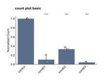
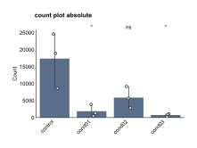
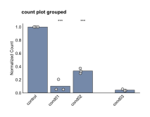
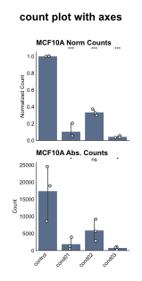

```{=html}
<style>
/* Scientific figures are line art on a transparent background: black text
   disappears on a dark page. Rather than maintaining a second set of dark
   figures, render them on a light card in both themes, so the published
   colours stay exactly as they appear in the paper. */
.fig-card {
  background: #ffffff;
  border: 1px solid rgba(0, 0, 0, 0.10);
  border-radius: 10px;
  padding: 1.25rem 1.25rem 0.5rem;
  margin: 1.75rem 0;
  box-shadow: 0 1px 4px rgba(0, 0, 0, 0.08);
}
.fig-card img { display: block; margin: 0 auto; max-width: 100%; height: auto; }
.fig-card figure { margin: 0; }
.fig-card figcaption {
  color: #3a3a3a;
  font-size: 0.86rem;
  line-height: 1.45;
  padding-top: 0.75rem;
}
</style>
```

The count plot module provides visualization for cell count analysis across experimental conditions. Count plots support both normalized and absolute count display, statistical significance testing, and flexible grouping layouts for comparative analysis.

See the [API reference](../reference/index.html) for full signatures and parameter documentation.

## Examples

### Basic Normalized Count Plot

Create a standard normalized count plot showing relative counts compared to control:

```python
from omero_screen_plots import count_plot
import pandas as pd

df = pd.read_csv("data.csv")
fig, ax = count_plot(
    df=df,
    norm_control="control",
    conditions=["control", "cond01", "cond02", "cond03"],
    condition_col="condition",
    selector_col="cell_line",
    selector_val="MCF10A",
    title="count plot basic",
    fig_size=(6, 4),
    save=True,
    file_format="svg"
)
```

::: {.fig-card}

:::

### Absolute Count Plot

Display raw cell counts without normalization to see actual numbers:

```python
from omero_screen_plots import count_plot, PlotType

fig, ax = count_plot(
    df=df,
    norm_control="control",
    conditions=["control", "cond01", "cond02", "cond03"],
    condition_col="condition",
    selector_col="cell_line",
    selector_val="MCF10A",
    plot_type=PlotType.ABSOLUTE,
    title="count plot absolute",
    fig_size=(6, 4),
    save=True,
    file_format="svg"
)
```

::: {.fig-card}

:::

### Grouped Layout

Group conditions for better visual organization and within-group statistical comparisons:

```python
fig, ax = count_plot(
    df=df,
    norm_control="control",
    conditions=["control", "cond01", "cond02", "cond03"],
    condition_col="condition",
    selector_col="cell_line",
    selector_val="MCF10A",
    group_size=3,
    within_group_spacing=0.2,
    between_group_gap=0.8,
    title="count plot grouped",
    fig_size=(6, 4)
)
```

::: {.fig-card}

:::

### Combined Subplot Analysis

Create multi-panel figures comparing normalized and absolute counts:

```python
import matplotlib.pyplot as plt
from omero_screen_plots.utils import save_fig

fig, axes = plt.subplots(2, 1, figsize=(2, 4))
fig.suptitle("count plot with axes", fontsize=8, weight="bold")

# Normalized counts
count_plot(
    df=df,
    norm_control="control",
    conditions=["control", "cond01", "cond02", "cond03"],
    condition_col="condition",
    selector_col="cell_line",
    selector_val="MCF10A",
    axes=axes[0],
    plot_type=PlotType.NORMALISED,
    x_label=False
)
axes[0].set_title("MCF10A Norm Counts", fontsize=8, weight="bold")

# Absolute counts
count_plot(
    df=df,
    norm_control="control",
    conditions=["control", "cond01", "cond02", "cond03"],
    condition_col="condition",
    selector_col="cell_line",
    selector_val="MCF10A",
    plot_type=PlotType.ABSOLUTE,
    axes=axes[1]
)
axes[1].set_title("MCF10A Abs. Counts", fontsize=8, weight="bold")

save_fig(fig, "output/", "count_plot_with_axes", fig_extension="svg")
```

::: {.fig-card}

:::
