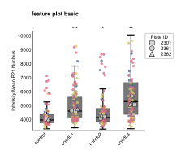
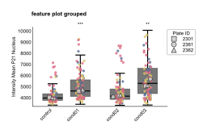
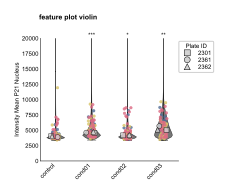
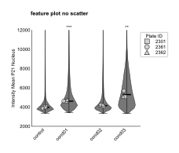
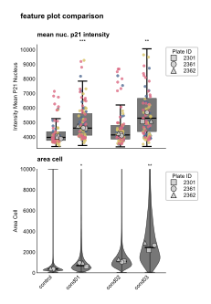

```{=html}
<style>
/* Scientific figures are line art on a transparent background: black text
   disappears on a dark page. Rather than maintaining a second set of dark
   figures, render them on a light card in both themes, so the published
   colours stay exactly as they appear in the paper. */
.fig-card {
  background: #ffffff;
  border: 1px solid rgba(0, 0, 0, 0.10);
  border-radius: 10px;
  padding: 1.25rem 1.25rem 0.5rem;
  margin: 1.75rem 0;
  box-shadow: 0 1px 4px rgba(0, 0, 0, 0.08);
}
.fig-card img { display: block; margin: 0 auto; max-width: 100%; height: auto; }
.fig-card figure { margin: 0; }
.fig-card figcaption {
  color: #3a3a3a;
  font-size: 0.86rem;
  line-height: 1.45;
  padding-top: 0.75rem;
}
</style>
```

The featureplot module provides flexible visualization options for comparing quantitative features across experimental conditions. Feature plots support both box plots and violin plots, with optional scatter point overlays, statistical significance testing, and flexible grouping layouts.

See the [API reference](../reference/index.html) for full signatures and parameter documentation.

## Examples

### Basic Box Plot

Create a standard box plot with scatter points and statistical significance marks:

```python
from omero_screen_plots import feature_plot
import pandas as pd

df = pd.read_csv("data.csv")
fig, ax = feature_plot(
    df=df,
    feature="intensity_mean_p21_nucleus",
    conditions=['control', 'cond01', 'cond02', 'cond03'],
    condition_col="condition",
    selector_col="cell_line",
    selector_val="MCF10A",
    title="feature plot basic",
    fig_size=(5, 5),
    save=True,
    file_format="svg"
)
```

::: {.fig-card}

:::

### Grouped Layout

Group conditions for better visual organization and within-group statistical comparisons:

```python
fig, ax = feature_plot(
    df=df,
    feature="intensity_mean_p21_nucleus",
    conditions=['control', 'cond01', 'cond02', 'cond03'],
    condition_col="condition",
    selector_col="cell_line",
    selector_val="MCF10A",
    title="feature plot grouped",
    group_size=2,
    within_group_spacing=0.2,
    between_group_gap=0.5,
    fig_size=(6, 4)
)
```

::: {.fig-card}

:::

### Violin Plots

Use violin plots to show the full distribution of your data:

```python
fig, ax = feature_plot(
    df=df,
    feature="intensity_mean_p21_nucleus",
    conditions=['control', 'cond01', 'cond02', 'cond03'],
    condition_col="condition",
    selector_col="cell_line",
    selector_val="MCF10A",
    title="feature plot violin",
    violin=True,
    ymax=20000,
    fig_size=(5, 5)
)
```

::: {.fig-card}

:::

### Clean Violin Plots

Remove scatter points for cleaner visualization with custom y-axis limits:

```python
fig, ax = feature_plot(
    df=df,
    feature="intensity_mean_p21_nucleus",
    conditions=['control', 'cond01', 'cond02', 'cond03'],
    condition_col="condition",
    selector_col="cell_line",
    selector_val="MCF10A",
    title="feature plot no scatter",
    violin=True,
    show_scatter=False,
    ymax=(2000, 12000),
    group_size=2,
    fig_size=(5, 5)
)
```

::: {.fig-card}

:::

### Combined Subplot Analysis

Create multi-panel figures comparing different features:

```python
import matplotlib.pyplot as plt
from omero_screen_plots.utils import save_fig

fig, axes = plt.subplots(2, 1, figsize=(2, 4))
fig.suptitle("feature plot comparison", fontsize=8, weight="bold")

# First subplot - p21 intensity
feature_plot(
    df=df,
    feature="intensity_mean_p21_nucleus",
    conditions=['control', 'cond01', 'cond02', 'cond03'],
    condition_col="condition",
    selector_col="cell_line",
    selector_val="MCF10A",
    axes=axes[0],
    group_size=2,
    x_label=False,
)
axes[0].set_title("mean nuc. p21 intensity", fontsize=7)

# Second subplot - cell area
feature_plot(
    df=df,
    feature="area_cell",
    conditions=['control', 'cond01', 'cond02', 'cond03'],
    condition_col="condition",
    selector_col="cell_line",
    selector_val="MCF10A",
    violin=True,
    show_scatter=False,
    ymax=10000,
    axes=axes[1],
    group_size=2,
)
axes[1].set_title("area cell", fontsize=7)

save_fig(fig, "output/", "feature_comparison", fig_extension="svg")
```

::: {.fig-card}

:::
