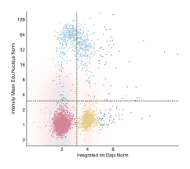
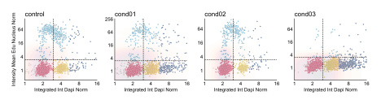
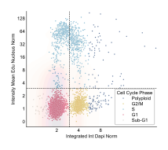
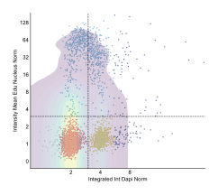

```{=html}
<style>
/* Scientific figures are line art on a transparent background: black text
   disappears on a dark page. Rather than maintaining a second set of dark
   figures, render them on a light card in both themes, so the published
   colours stay exactly as they appear in the paper. */
.fig-card {
  background: #ffffff;
  border: 1px solid rgba(0, 0, 0, 0.10);
  border-radius: 10px;
  padding: 1.25rem 1.25rem 0.5rem;
  margin: 1.75rem 0;
  box-shadow: 0 1px 4px rgba(0, 0, 0, 0.08);
}
.fig-card img { display: block; margin: 0 auto; max-width: 100%; height: auto; }
.fig-card figure { margin: 0; }
.fig-card figcaption {
  color: #3a3a3a;
  font-size: 0.86rem;
  line-height: 1.45;
  padding-top: 0.75rem;
}
</style>
```

The scatter plot provides intelligent visualization for exploring relationships between two quantitative features with automatic context detection for cell cycle analysis and extensive customization options.

See the [API reference](../reference/index.html) for full signatures and parameter documentation.

## Examples

### Basic Feature Correlation

Create a standard scatter plot to explore relationships between two features:

```python
from omero_screen_plots import scatter_plot
import pandas as pd

df = pd.read_csv("data.csv")
fig, ax = scatter_plot(
    df=df,
    x_feature="area_cell",
    y_feature="intensity_mean_p21_nucleus",
    conditions=['control', 'cond01', 'cond02', 'cond03'],
    condition_col="condition",
    selector_col="cell_line",
    selector_val="MCF10A",
    title="Cell Area vs p21 Intensity",
    save=True,
    file_format="svg"
)
```

::: {.fig-card}

:::

### Multiple Condition Comparison

Compare feature relationships across different experimental conditions:

```python
fig, ax = scatter_plot(
    df=df,
    x_feature="area_cell",
    y_feature="intensity_mean_p21_nucleus",
    conditions=['control', 'cond01', 'cond02', 'cond03'],
    condition_col="condition",
    selector_col="cell_line",
    selector_val="MCF10A",
    title="Multi-Condition Feature Analysis"
)
```

::: {.fig-card}

:::

### Cell Cycle Context Detection

Automatic cell cycle visualization with DNA content and EdU incorporation:

```python
fig, ax = scatter_plot(
    df=df,
    x_feature="integrated_int_DAPI_norm",  # Auto-detected as DNA content
    y_feature="intensity_mean_EdU_nucleus_norm",  # Auto-detected as EdU
    conditions=['control', 'cond01', 'cond02'],
    condition_col="condition",
    selector_col="cell_line",
    selector_val="MCF10A",
    title="Cell Cycle Analysis"
)
```

::: {.fig-card}

:::

### Threshold Analysis

Apply threshold-based classification with custom coloring:

```python
fig, ax = scatter_plot(
    df=df,
    x_feature="area_cell",
    y_feature="intensity_mean_p21_nucleus",
    conditions=['control', 'treatment'],
    condition_col="condition",
    selector_col="cell_line",
    selector_val="MCF10A",
    threshold=5000,  # Threshold value for y-axis
    title="Threshold-Based Classification"
)
```

::: {.fig-card}

:::

### KDE Density Overlay

Add kernel density estimation for distribution visualization:

```python
fig, ax = scatter_plot(
    df=df,
    x_feature="integrated_int_DAPI_norm",
    y_feature="intensity_mean_EdU_nucleus_norm",
    conditions=['control'],
    condition_col="condition",
    selector_col="cell_line",
    selector_val="MCF10A",
    kde_overlay=True,
    title="Density Distribution Analysis"
)
```

::: {.fig-card}

:::
